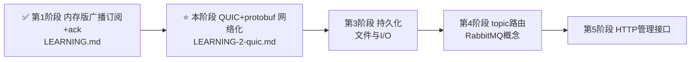
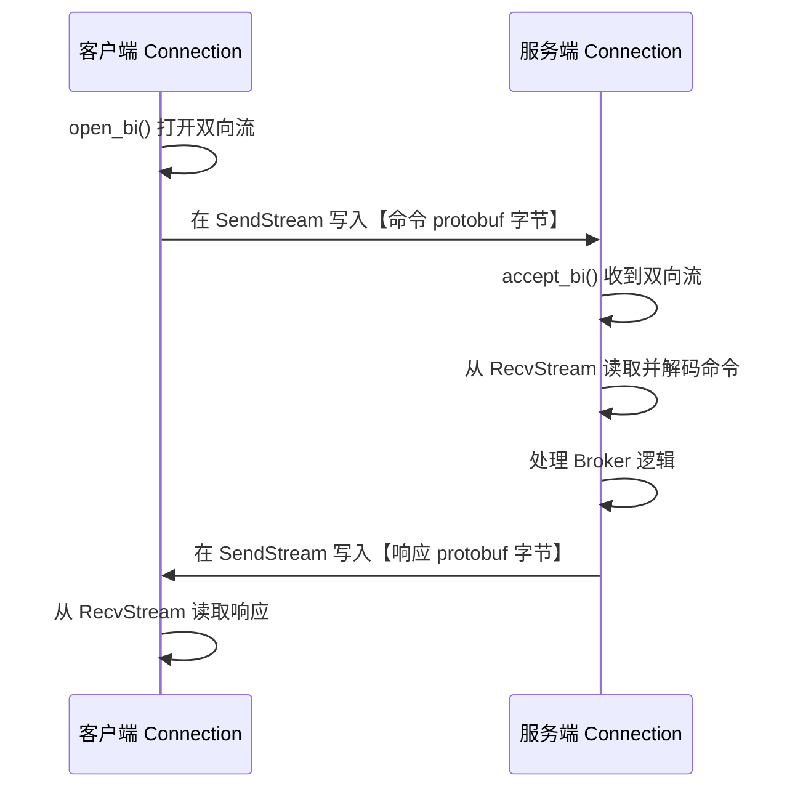
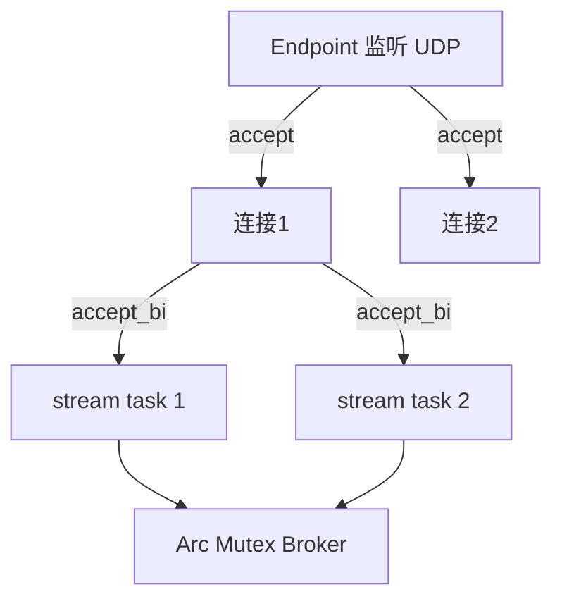
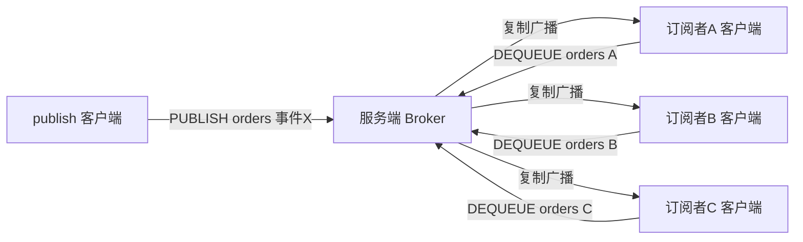
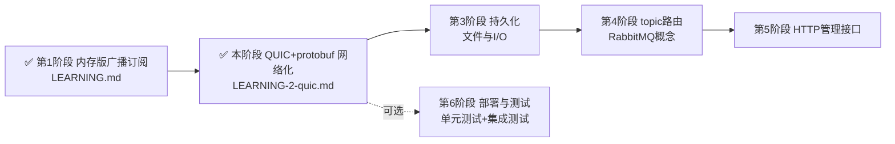

# Mymq-rs 学习文档 第 2 阶段：QUIC + Protobuf 网络化改造

> 这份文档是 `LEARNING.md` 的**续篇**。在 `LEARNING.md` 中，你已经手动实现了一个内存版「广播/订阅 + 每订阅者独立 ack + 超时重投」的消息队列。
>
> 现在我们要把它升级成真正的**客户端/服务端架构**：用 **QUIC（HTTP/3 的传输层）** 取代 TCP，用 **Protocol Buffers（protobuf）** 做消息序列化，把 broker 的核心操作（`publish` / `dequeue` / `ack` / `nack` / `subscribe`）暴露成**网络命令**，让远程客户端可以连接进来发布和消费消息。
>
> 延续 `LEARNING.md` 的教学方式：**分步引导 + 手动补齐 + 运行验证**，核心逻辑留给你自己写。

---

## 目录

- [第 0 章 前置条件与路线定位](#第-0-章-前置条件与路线定位)
- [第 1 章 概念铺垫：QUIC 与 Protobuf](#第-1-章-概念铺垫quic-与-protobuf)
  - [1.1 QUIC 是什么，为什么用它做 MQ 传输](#11-quic-是什么为什么用它做-mq-传输)
  - [1.2 quinn 连接与 stream 模型](#12-quinn-连接与-stream-模型)
  - [1.3 Protobuf 与 prost](#13-protobuf-与-prost)
- [第 2 章 协议设计：命令与消息的 proto 定义](#第-2-章-协议设计命令与消息的-proto-定义)
- [第 3 章 分步实现（核心章节）](#第-3-章-分步实现核心章节)
  - [步骤一 添加依赖与工程准备](#步骤一-添加依赖与工程准备)
  - [步骤二 编写 mq.proto 与代码生成](#步骤二-编写-mqproto-与代码生成)
  - [步骤三 生成证书（QUIC 强制 TLS）](#步骤三-生成证书quic-强制-tls)
  - [步骤四 实现 Broker 命令处理层](#步骤四-实现-broker-命令处理层)
  - [步骤五 实现 quinn 服务端](#步骤五-实现-quinn-服务端)
  - [步骤六 实现 quinn 客户端](#步骤六-实现-quinn-客户端)
  - [步骤七 命令行演示工具与联调](#步骤七-命令行演示工具与联调)
- [第 4 章 完整扩展路径（更新后的路线地图）](#第-4-章-完整扩展路径更新后的路线地图)
- [附录 依赖版本、证书与调试](#附录-依赖版本证书与调试)

---

## 第 0 章 前置条件与路线定位

**这份文档假设你已经完成了 `LEARNING.md` 的全部步骤**，即你手上已经有一个：

- 用 `Arc<tokio::sync::Mutex<Broker>>` 共享状态的内存版 broker
- `Broker` 具备方法：`subscribe` / `publish` / `dequeue` / `ack` / `nack` / `redeliver_timeout` / `stats`
- 结构：`Message { id, body }`、`SubscriberState { pending, inflight }`、`Topic { subscribers }`、`Broker { topics, next_id, notifier }`

> ⚠️ **重要提醒**：本阶段我们要把这些**内存里的方法**变成**能通过网络调用的命令**。所以你在 `LEARNING.md` 里实现的方法会原封不动地被复用——只是多了「网络这一层」把它们暴露出去。

**在原有路线图中，本阶段的位置**：



> 原计划的「第 2 阶段 TCP 服务化」**升级为本阶段的「QUIC + protobuf 网络化」**。QUIC 与 TCP 的传输层职责相同，但 QUIC 是 HTTP/3 的基础、自带 TLS 加密与多路复用，更现代。

---

## 第 1 章 概念铺垫：QUIC 与 Protobuf

### 1.1 QUIC 是什么，为什么用它做 MQ 传输

**QUIC**（RFC 9000）是新一代传输层协议，也是 **HTTP/3** 的底层。它由 Google 发明、IETF 标准化，设计目标是**取代 TCP + TLS**。

对比传统方案（TCP + 独立 TLS）：

| 维度 | TCP + TLS | QUIC |
|------|-----------|------|
| 握手延迟 | TCP 1 个 RTT + TLS 1 个 RTT | **0-RTT / 1-RTT**，更快建立连接 |
| 加密 | 额外一层 TLS，需手动配置 | **协议内建 TLS 1.3**，强制加密 |
| 多路复用 | TCP 是单字节流，HTTP/2 靠头部解决 | **原生多路复用 stream**，多条流互不阻塞 |
| 消息边界 | 字节流，需自己处理粘包/拆包 | **stream 自带语义**，一条 stream 一份数据 |
| 队头阻塞 | 丢一个包阻塞整条连接 | 每 stream 独立，丢包只影响自己 |

**为什么适合做 MQ 传输？**

1. **原生多路复用**：一条 QUIC 连接可以开多条 stream，每一条 stream 独立承载一个命令请求 + 响应，天然支持并发，且不存在 TCP 的粘包/拆包问题——这对 MQ 这种「命令密集」场景非常合适。
2. **内置加密**：消息在网络上自动加密，符合生产 MQ 的安全需求。
3. **快速建连**：0-RTT 重连机制对频繁断线重连的客户端友好。

> 📖 **对学习者**：QUIC 抽象出了「连接（connection）」和「流（stream）」两个概念。连接是持久的长连接，流是连接上的一条独立数据通道（类似 TCP 连接里的「会话」）。你可以在同一连接上并发开多条流。

### 1.2 quinn 连接与 stream 模型

**quinn** 是 Rust 生态最主流的 QUIC 实现，**tokio 原生**，异步 API 友好，是学习入门首选。

quinn 的核心类型：

| 类型 | 角色 | 说明 |
|------|------|------|
| `quinn::Endpoint` | 端节点 | 既是服务端监听器，也是客户端连接器 |
| `quinn::Incoming` | 入站连接流 | 服务端用它 `accept()` 接收新连接 |
| `quinn::Connecting` | 正在建立的连接 | `.await` 后得到 `Connection` |
| `quinn::Connection` | 一条连接 | 可 `open_bi()` 开双向流、`accept_bi()` 接收流 |
| `quinn::SendStream` | 发送流 | 写数据（半条双向流） |
| `quinn::RecvStream` | 接收流 | 读数据（另半条双向流） |

典型的**双向流（bi-stream）请求-响应**模型：



> 每条命令都用「开一条双向流」来承载：请求写在流的写半部，响应从流的读半部读回。这就是本项目的核心通信模式。

### 1.3 Protobuf 与 prost

**Protocol Buffers（protobuf）** 是 Google 提出的**跨语言二进制序列化格式**。你用一个 `.proto` 文件定义数据结构，然后由编译器生成各种语言的代码，负责「内存对象 ↔ 二进制字节」的互转。

与 JSON/手写二进制对比：

| 维度 | JSON | 手写二进制 | Protobuf |
|------|------|-----------|----------|
| 可读性 | ✅ 人类可读 | ❌ | ❌（但可用工具解码） |
| 体积 | 大（文本冗余） | 最小 | **小**（紧凑编码） |
| 类型安全 | 弱 | 靠自己 | **强**（编译期生成类型） |
| 跨语言 | ✅ | 需自己约定 | ✅（官方多语言支持） |
| 字段演进 | 容易 | 难 | **✅ 向后兼容**（字段号机制） |

**prost** 是 Rust 生态的 protobuf 实现。配套关系：

- `prost`：提供 protobuf 消息类型和编解码 API
- `prost-build`：在 `build.rs` 里读取 `.proto` 文件，生成 Rust 代码（编译期）
- `.proto` 文件：你手写的协议定义

> 📖 **关键理解**：`.proto` 是「唯一真相」，`.rs` 代码是「生成的」。改协议只改 `.proto`，重编译即可重新生成代码，不用手写二进制解析。

---

## 第 2 章 协议设计：命令与消息的 proto 定义

在写代码前，先把**网络协议**设计清楚。我们要把内存版 broker 的 4 个核心操作变成网络命令：

| 内存方法 | 网络命令 | 参数 | 返回值 |
|---------|---------|------|--------|
| `subscribe(topic, sub)` | `SUBSCRIBE` | topic, subscriber | 是否成功 |
| `publish(topic, body)` | `PUBLISH` | topic, body | 消息 id |
| `dequeue(topic, sub)` | `DEQUEUE` | topic, subscriber | 一条消息（可能为空） |
| `ack(topic, sub, id)` | `ACK` | topic, subscriber, msg_id | 是否成功 |
| `nack(topic, sub, id)` | `NACK` | topic, subscriber, msg_id | 是否成功 |

我们用一个**带 oneof 的 Command 消息**统一封装所有命令，再用一个 **Response 消息**统一封装所有响应。

> 📖 **protobuf 的 oneof**：表示「这个字段是下列若干种之一」。非常适合表达「命令的分发类型」。

```protobuf
// proto/mq.proto
syntax = "proto3";

package mq;

// 一条消息
message Message {
  uint64 id = 1;
  string body = 2;
}

// 客户端发来的命令
message Command {
  oneof cmd {
    Subscribe subscribe = 1;
    Publish publish = 2;
    Dequeue dequeue = 3;
    Ack ack = 4;
    Nack nack = 5;
  }

  message Subscribe {
    string topic = 1;
    string subscriber = 2;
  }
  message Publish {
    string topic = 1;
    string body = 2;
  }
  message Dequeue {
    string topic = 1;
    string subscriber = 2;
  }
  message Ack {
    string topic = 1;
    string subscriber = 2;
    uint64 msg_id = 3;
  }
  message Nack {
    string topic = 1;
    string subscriber = 2;
    uint64 msg_id = 3;
  }
}

// 服务端返回的响应
message Response {
  bool ok = 1;                       // 命令是否成功
  uint64 msg_id = 2;                 // PUBLISH/DEQUEUE 返回的消息 id
  Message message = 3;               // DEQUEUE 返回的消息体（无消息时为空）
  string error = 4;                  // 失败时的错误信息
}
```

> 💡 **设计思考**：为什么用 oneof 而不用一个「命令类型 + 一堆可选字段」？因为 oneof 在编译期就保证了「只可能是一种命令」，类型更安全。这是 protobuf 的推荐做法。

---

## 第 3 章 分步实现（核心章节）

> ⚠️ **约定**：本章会指导你**新建**多个文件，不再只改 `main.rs`：
> - `proto/mq.proto` —— 协议定义
> - `build.rs` —— prost 代码生成
> - `src/broker.rs` —— 把内存版 broker 抽出来（复用 LEARNING.md 的成果）
> - `src/bin/server.rs` —— quinn 服务端
> - `src/bin/client.rs` —— quinn 客户端（命令行工具）
>
> 每一步仍遵循「目标 / 概念讲解 / 实现提示 / 验证方式」结构。

---

### 步骤一 添加依赖与工程准备

**本步目标**：给 `Cargo.toml` 加上 QUIC、protobuf、证书生成的依赖，并把内存版 broker 抽到独立模块。

**概念讲解**：

本阶段需要的依赖分成三类：

| 依赖 | 用途 | 放在哪 |
|------|------|--------|
| `quinn` | QUIC 协议实现 | `[dependencies]` |
| `prost` | protobuf 编解码 API | `[dependencies]` |
| `prost-build` | 从 `.proto` 生成代码 | `[build-dependencies]` |
| `rcgen` | 生成本地自签名 TLS 证书 | `[dependencies]` |
| `tokio` | 异步运行时（已有） | `[dependencies]` |

**实现提示**：编辑 `Cargo.toml`，追加：

```toml
[dependencies]
tokio = { version = "1.53.1", features = ["rt-multi-thread", "macros", "sync"] }
quinn = "0.11"
prost = "0.13"
rcgen = "0.13"
anyhow = "1"          # 简化错误处理（可选但推荐）
bytes = "1"           # quinn 流读写用 Bytes 缓冲（quinn 依赖它，方便处理）

[build-dependencies]
prost-build = "0.13"
```

> ⚠️ **版本提示**：quinn / prost / rcgen 的版本号请以**你执行 `cargo add` 时的最新版本为准**。上面是示例。建议直接在项目根目录运行：
> ```bash
> cargo add quinn prost rcgen anyhow bytes
> cargo add --build prost-build
> ```
> 让 cargo 自动挑选当前可用版本，避免手写版本号过期。

**工程结构调整**：把 `LEARNING.md` 里你写好的 broker 逻辑抽到 `src/broker.rs`，然后在 `src/main.rs` 里 `mod broker;`。这样服务端、客户端、未来的模块都能 `use broker::Broker;`。

**请你动手**：
1. 运行上面的 `cargo add` 命令
2. 把你在 `LEARNING.md` 中实现的 `Broker` 及相关结构（`Message`/`Topic`/`SubscriberState`）整体移动到新文件 `src/broker.rs`，并把 `pub` 关键字加上（`pub struct Broker`、`pub fn ...`）
3. 在 `src/main.rs` 顶部写 `mod broker;` 让它能引用

**验证方式**：`cargo check` 通过。此时你可能要处理 `mod broker` 的可见性报错——把需要外部访问的类型/方法都标上 `pub`。

---

### 步骤二 编写 mq.proto 与代码生成

**本步目标**：写好 `proto/mq.proto`（第 2 章的内容），配置 `build.rs` 自动生成 Rust 代码，并验证生成成功。

**概念讲解**：

prost 的工作方式是：编译时（`build.rs`）读 `.proto` → 生成 `mq.rs` 到 `OUT_DIR` → 你的代码用 `include!(concat!(env!("OUT_DIR"), "/mq.rs"))` 引入生成的模块。


**实现提示**：

1. 创建 `proto/mq.proto`，内容直接用第 2 章的定义。

2. 创建 `build.rs`（项目根目录）：

```rust
fn main() {
    prost_build::compile_protos(&["proto/mq.proto"], &["proto/"]).unwrap();
}
```

3. 在你需要用到协议类型的地方（比如新模块 `src/proto.rs`），引入生成代码：

```rust
pub mod mq {
    include!(concat!(env!("OUT_DIR"), "/mq.rs"));
}
```

**请你动手**：创建 `proto/mq.proto` 和 `build.rs`，把生成代码封装进 `src/proto.rs`。

**验证方式**：
1. `cargo build` 能通过（prost 会在编译期生成代码）
2. 在 `src/proto.rs` 里临时写个测试：`let _ = mq::Command { cmd: None };` 确认类型可用
3. 想确认生成成功，可以查看 `target/.../build/mymq-rs-*/out/mq.rs`（`cargo build` 后 `OUT_DIR` 下的文件）

> 📖 **注意**：`mq::Command` 里没有 `Default`？prost 生成的消息都实现了 `Default` 和 `PartialEq`，所以 `Command::default()` 可用。但 oneof 字段初始为 `None`。

---

### 步骤三 生成证书（QUIC 强制 TLS）

**本步目标**：用 `rcgen` 生成本地自签名证书，供 QUIC 服务端使用（QUIC 内建 TLS，必须有证书）。

**概念讲解**：

QUIC 强制加密（TLS 1.3 内建），所以服务端**必须**提供证书。本地学习场景用自签名证书即可——重点在协议与业务，不在 PKI。生成逻辑：用 `rcgen` 创建 CA 和服务器证书，写到磁盘（`cert.der` / `key.der`），服务端启动时读取。

**实现提示**：创建一个 `src/bin/gen_cert.rs`，运行时生成证书文件：

```rust
use rcgen::{CertificateParams, KeyPair, SanType};
use std::fs;

fn main() -> anyhow::Result<()> {
    // 1. 生成一个自签名的本地服务器证书
    let key_pair = KeyPair::generate()?;
    let mut params = CertificateParams::default();
    params.subject_alt_names = vec![
        SanType::DnsName("localhost".into()),
        SanType::IpAddress("127.0.0.1".parse()?),
    ];
    let cert = params.self_signed(&key_pair)?;

    // 2. 写到磁盘
    fs::write("cert.der", cert.der())?;
    fs::write("key.der", key_pair.serialize_der())?;
    println!("证书已生成：cert.der / key.der");
    Ok(())
}
```

**请你动手**：创建 `src/bin/gen_cert.rs` 并运行 `cargo run --bin gen_cert`，确认 `cert.der` 和 `key.der` 出现在项目根目录。

**验证方式**：运行 `cargo run --bin gen_cert`，看到「证书已生成」的打印，且目录下出现两个 `.der` 文件。

> ⚠️ **安全提示**：证书和私钥文件**不要提交到 git**（在 `.gitignore` 里加上 `cert.der`、`key.der`）。这仅用于本地学习，绝不可用于生产。

---

### 步骤四 实现 Broker 命令处理层

**本步目标**：在 `src/broker.rs` 的 `Broker` 上新增一个「命令处理」方法，接收一个 `Command`，返回 `Response`，把网络层和业务层解耦。

**概念讲解**：

这一步是**桥接层**：客户端发来的 `Command`（protobuf 类型）要在这里被翻译成对内存 broker 方法的调用。好处是服务端代码不用关心 protobuf 细节，broker 也不用关心网络。

命令 → 处理 → 响应 的映射：

```rust
pub fn handle_command(&mut self, cmd: mq::Command) -> mq::Response {
    use mq::command::Cmd;
    match cmd.cmd {
        Some(Cmd::Subscribe(s)) => {
            self.subscribe(&s.topic, &s.subscriber);
            Response { ok: true, ..Default::default() }
        }
        // ... PUBLISH / DEQUEUE / ACK / NACK
        None => Response { ok: false, error: "未知命令".into(), ..Default::default() },
    }
}
```

**实现提示**（关键分支的翻译逻辑）：

- **PUBLISH**：调用 `self.publish(&p.topic, p.body)`，返回 `Response { ok: true, msg_id }`
- **DEQUEUE**：调用 `self.dequeue(&d.topic, &d.subscriber)`，得到 `Option<Message>`。有则放进 `Response.message`，无则 `ok: true` 且 message 为空（表示暂时没消息）
- **ACK / NACK**：调用对应方法，根据返回的 `bool` 设置 `ok`

注意：你的 `Broker` 需要 `use` 一下 proto 类型。在 `src/broker.rs` 顶部加 `use crate::proto::mq;`（如果你的 proto 模块放在 `crate::proto`）。

**请你动手**：给 `Broker` 加 `handle_command` 方法，完成 5 种命令的翻译。思考：`dequeue` 返回空时，怎么在 `Response` 里表达「没消息」而不是「出错」？

**验证方式**：`cargo check` 通过。可写临时测试：构造一个 `Publish` 命令，调用 `handle_command`，检查返回的 `msg_id > 0`。

---

### 步骤五 实现 quinn 服务端

**本步目标**：创建 `src/bin/server.rs`，启动 quinn 服务端，监听 UDP 端口，为每个入站 stream 派一个 task，处理并响应命令。

**概念讲解**：

quinn 服务端三步曲：

1. **加载证书**：读取 `cert.der` / `key.der`，配置 TLS
2. **构建 Endpoint**：`ServerConfig` + `Endpoint::server(...)`，开始监听
3. **accept 循环**：`endpoint.accept().await` 收新连接；每个连接上再 `accept_bi()` 收双向流，每来一条流派一个 task 处理

服务端状态共享：因为 broker 要在**多个 stream task** 之间共享，所以用 `Arc<Mutex<Broker>>`（你在 LEARNING.md 里就是这么做的，现在复用到网络场景）。



**实现提示**（服务端骨架）：

```rust
use std::sync::Arc;
use quinn::{Endpoint, ServerConfig, TransportConfig};
use tokio::sync::Mutex;
use mymq::proto::mq;
use mymq::broker::Broker;

async fn handle_stream(
    mut send: quinn::SendStream,
    mut recv: quinn::RecvStream,
    broker: Arc<Mutex<Broker>>,
) -> anyhow::Result<()> {
    // 1. 读取请求（一条命令 = 一段字节流）
    let data = recv.read_to_end(64 * 1024).await?;
    let cmd: mq::Command = prost::Message::decode(&*data)?;

    // 2. 处理命令
    let resp = broker.lock().await.handle_command(cmd);

    // 3. 编码并写回响应
    let buf = prost::Message::encode_to_vec(&resp);
    send.write_all(&buf).await?;
    Ok(())
}
```

以及 main 里构建 endpoint + 循环 accept：

```rust
#[tokio::main]
async fn main() -> anyhow::Result<()> {
    let (cert, key) = load_cert();        // 读 cert.der / key.der
    let mut server_config = quinn::ServerConfig::with_single_cert(cert, key)?;
    let transport = Arc::new(TransportConfig::default());
    server_config.transport = transport;

    let endpoint = Endpoint::server(server_config, "127.0.0.1:8443".parse()?)?;
    let broker = Arc::new(Mutex::new(Broker::new()));
    println!("服务端已启动，监听 127.0.0.1:8443");

    while let Some(incoming) = endpoint.accept().await {
        let broker = Arc::clone(&broker);
        tokio::spawn(async move {
            let conn = incoming.await?;   // 握手完成
            while let Ok((send, recv)) = conn.accept_bi().await {
                let broker = Arc::clone(&broker);
                tokio::spawn(handle_stream(send, recv, broker));
            }
            Ok::<(), anyhow::Error>(())
        });
    }
    Ok(())
}
```

> 📖 **要点**：
> - `prost::Message` trait 提供了 `decode`（字节→对象）和 `encode_to_vec`（对象→字节）两个核心方法
> - `read_to_end` 会读到流关闭为止——所以**客户端必须在写完后关闭发送半部**（见步骤六），服务端才能知道「数据结束了」
> - 每个连接派一个 task，每条流再派一个 task，充分利用 tokio 并发

**请你动手**：创建 `src/bin/server.rs`，补全 `load_cert()`（用 `quinn::rustls::pki_types` 从 `cert.der`/`key.der` 构造 `CertificateDer` / `PrivateKeyDer`）。

**验证方式**：`cargo build` 通过。运行 `cargo run --bin server`，应看到「服务端已启动」。此时还没有客户端连它，会一直等待——正常。

> 💡 **提示**：quinn 的证书加载 API 涉及 `rustls::pki_types::CertificateDer`。如果你卡住，用 `cargo doc -p quinn` 查看示例，或搜索 `quinn ServerConfig with_single_cert`。

---

### 步骤六 实现 quinn 客户端

**本步目标**：创建 `src/bin/client.rs`，用 `quinn` 连接服务端，发送命令、接收响应，并暴露成简单的命令行参数用法。

**概念讲解**：

quinn 客户端流程（与 TCP connect 对称，但**必须配置证书信任**）：

1. 构建 `ClientConfig`，信任自签名证书（本地学习：直接信任该证书，或跳过校验——**仅限学习**）
2. `Endpoint::client(addr)` 得到客户端 endpoint
3. `endpoint.connect(server_name, addr)` 建立连接
4. `conn.open_bi()` 开一条双向流，写命令、读响应

**实现提示**（客户端骨架）：

```rust
use quinn::{ClientConfig, Endpoint};
use mymq::proto::mq;

async fn send_command(conn: &quinn::Connection, cmd: mq::Command) -> anyhow::Result<mq::Response> {
    // 1. 打开双向流
    let (mut send, mut recv) = conn.open_bi().await?;
    // 2. 编码命令并写入，然后关闭发送半部（关键！）
    let buf = prost::Message::encode_to_vec(&cmd);
    send.write_all(&buf).await?;
    send.finish().await?;   // 告诉对端：数据结束了

    // 3. 读取响应
    let data = recv.read_to_end(64 * 1024).await?;
    Ok(prost::Message::decode(&*data)?)
}
```

main 里按命令行参数分发命令：

```rust
// 用法：client publish <topic> <body>
//       client dequeue <topic> <sub>
//       client ack <topic> <sub> <id>
//       client nack <topic> <sub> <id>
//       client subscribe <topic> <sub>
let args: Vec<String> = std::env::args().collect();
match args[1].as_str() {
    "publish" => { /* 构造 Command::Publish，send_command */ }
    "dequeue" => { /* 构造 Command::Dequeue */ }
    // ...
}
```

**请你动手**：创建 `src/bin/client.rs`，实现 `send_command` 和基于命令行参数的命令分发。需要自己处理「信任自签名证书」的配置（`ClientConfig` 里注入自定义根证书）。

**验证方式**：先启动服务端，再开另一个终端运行客户端命令。构造 `Command` 的代码里，oneof 赋值方式形如：

```rust
mq::Command {
    cmd: Some(mq::command::Cmd::Publish(mq::command::Publish {
        topic: "...".into(),
        body: "...".into(),
    })),
}
```

> 📖 **注意**：`Command` 的 oneof 字段在生成代码里叫 `cmd`，类型是 `Option<mq::command::Cmd>`。prost 会把 `.proto` 里 oneof 的名称 `cmd` 变成字段名，枚举名叫 `command::Cmd`。

---

### 步骤七 命令行演示工具与联调

**本步目标**：写一个综合演示脚本/说明，用多个客户端模拟「广播订阅」效果，验证跨网络的多订阅者隔离仍然成立。

**概念讲解**：

QUIC 网络化后，广播语义应该**完全不变**：多个客户端分别 subscribe 到同一 topic，一个客户端 publish 一条消息，所有订阅者客户端都应该能各自 dequeue 到它。

演示流程（开多个终端）：



**实现提示**：为了让演示可重复、结果可观察，建议：

1. 在 `client` 里加一个 `subscribe` 命令（步骤六已具备）
2. 写一份 `演示脚本.md` 或直接在文档说明操作顺序：
   - 终端1：`cargo run --bin server`
   - 终端2：`cargo run --bin client -- subscribe orders 推送组`
   - 终端3：`cargo run --bin client -- subscribe orders 库存组`
   - 终端4：`cargo run --bin client -- publish orders "事件：新订单001"`
   - 终端2：`cargo run --bin client -- dequeue orders 推送组`
   - 终端3：`cargo run --bin client -- dequeue orders 库存组`

**验证方式（最终验收）**：

1. 服务端打印「收到 PUBLISH 命令」
2. 每个订阅者客户端 dequeue 后，**都能打印出同一条消息**（相同 msg_id 和 body）——证明跨网络广播成功
3. 若只 dequeue 一个订阅者、ack 掉，另一个订阅者仍能 dequeue 到同一条（因为广播复制了多份）——证明**每订阅者独立进度**在网络上依然成立

> 如果这些都通了——恭喜，你已成功把内存版 MQ 改造成了 **QUIC + protobuf 的跨网络消息队列**！

---

## 第 4 章 完整扩展路径（更新后的路线地图）

至此，你的项目网络层已经完成。下面是**更新后**的完整路线：



| 阶段 | 做什么 | 关键知识点 | 前置依赖 |
|------|--------|-----------|---------|
| **第 1 阶段 ✅** | 内存版广播订阅 + ack + 超时重投 | `Arc`/`Mutex`/`Notify`、状态机 | 无 |
| **第 2 阶段 ✅** | **QUIC + protobuf 网络化** | `quinn`、`prost`、TLS 证书、自定义协议 | 第 1 阶段 |
| **第 3 阶段：持久化** | 消息 append-log 追加写磁盘、启动恢复 | `std::fs`、文件追加写、崩溃一致性 | 第 2 阶段 |
| **第 4 阶段：topic 路由** | exchange + routing key 绑定，按规则路由 | 路由表、binding key、多 exchange 类型 | 第 2 阶段 |
| **第 5 阶段：HTTP 管理接口** | 用 `axum` 提供 REST API 查询/管理 | `axum`、JSON、HTTP 路由 | 第 2 阶段 |
| **第 6 阶段（可选）：测试** | 为 broker、命令层、服务端写单元/集成测试 | `#[tokio::test]`、测试组织 | 第 2 阶段 |

### 各阶段详解与建议

**第 3 阶段：持久化**
- 命中「文件与 I/O」
- 最简单方案：`publish` 处理时把消息追加写 log 文件，服务端启动时读回 `pending`
- 进阶思考：写日志 vs 定期快照、崩溃后不丢、是否需要 fsync、QUIC 连接断开时的处理

**第 4 阶段：topic 路由**
- 引入 RabbitMQ 的 exchange 概念：direct / fanout / topic
- 广播是 fanout 的特例（所有订阅者都收到）
- 可以在现有 `publish` 基础上扩展路由逻辑

**第 5 阶段：HTTP 管理接口**
- 复用你已写好的 `stats()` 方法
- 可以单独开一个 TCP/HTTP 端口，不干扰 QUIC 的业务端口

**第 6 阶段：测试（强烈推荐穿插做）**
- 现在你有 `broker.rs` 纯逻辑层 + `server.rs`/`client.rs` 网络层
- broker 层非常适合写 `#[tokio::test]` 单元测试（不涉及网络）
- 命令层 `handle_command` 也可以直接测（构造 Command → 检查 Response）

> 💡 **学习节奏建议**：QUIC + protobuf 是本项目的一个**里程碑**。到这里你已经覆盖了「网络协议设计」这个核心技术方向。建议先停下来，为 broker 和命令层补一些单元测试，巩固理解，再决定是否进入第 3 阶段。

---

## 附录 依赖版本、证书与调试

### 依赖安装命令

```bash
# 添加运行时依赖
cargo add quinn prost rcgen anyhow bytes
# 添加构建期依赖（代码生成）
cargo add --build prost-build
```

### 证书命令

```bash
# 生成本地自签名证书
cargo run --bin gen_cert

# 检查证书文件是否生成
ls cert.der key.der
```

### 运行命令

```bash
# 启动服务端（监听 127.0.0.1:8443）
cargo run --bin server

# 客户端命令示例（另开终端）
cargo run --bin client -- subscribe orders 推送组
cargo run --bin client -- publish orders "事件：新订单001"
cargo run --bin client -- dequeue orders 推送组
cargo run --bin client -- ack orders 推送组 1
cargo run --bin client -- nack orders 库存组 2
```

### 调试技巧

1. **「读不到响应」**：多半是没 `send.finish()`。服务端靠流的关闭来知道数据结束，客户端写完后必须 `finish()`（见步骤六）。
2. **证书报错 / 握手失败**：确认服务端用 `ServerConfig::with_single_cert`，客户端配置里信任了同一张证书。自签名证书两边都要正确加载。
3. **想让 quinn 打日志**：`RUST_LOG=debug cargo run --bin server`，配合 `env_logger` 或 `tracing-subscriber` 初始化。
4. **想确认生成的 proto 代码**：`cargo build` 后，在 `target/debug/build/mymq-rs-*/out/` 下找 `mq.rs`，看生成的消息结构（尤其 oneof 的枚举名）。
5. **命令对不上**：`Command` 的 oneof 字段名在生成代码里叫 `cmd`，构造时用 `mq::command::Cmd::Xxx(...)`，别写成别的名字。

### .gitignore 建议追加

```gitignore
cert.der
key.der
```

---

> 🎉 **到这里，你已经把内存版 MQ 成功升级为「QUIC + protobuf」的跨网络消息队列**。你掌握的不只是 quinn 和 prost 的用法，更是「传输协议选择 + 序列化格式设计 + 自定义 RPC 协议 + 并发共享状态」这套完整的网络编程方法论。带着这套理解，第 3 阶段的持久化改造就水到渠成了。
