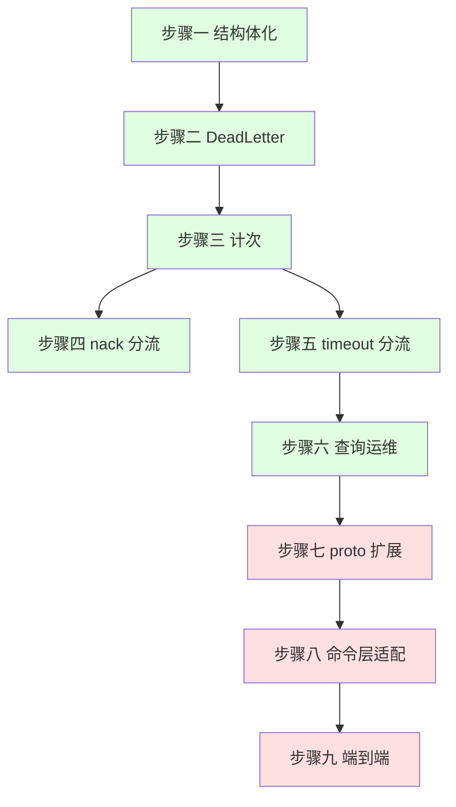
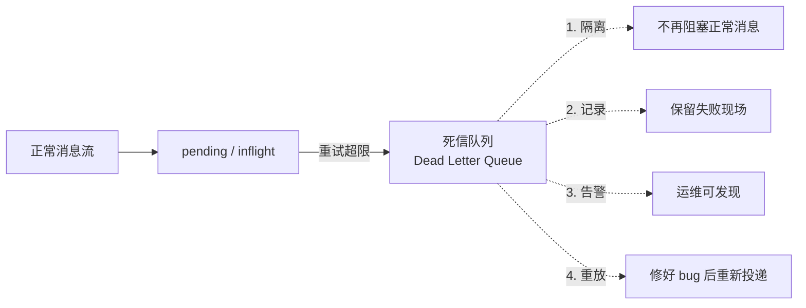
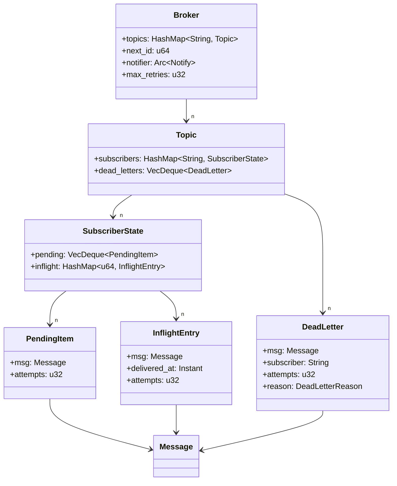
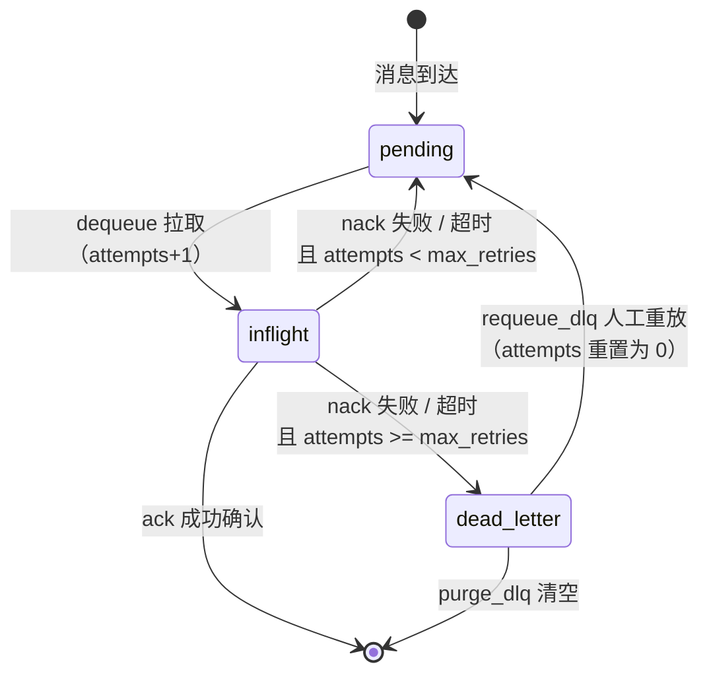
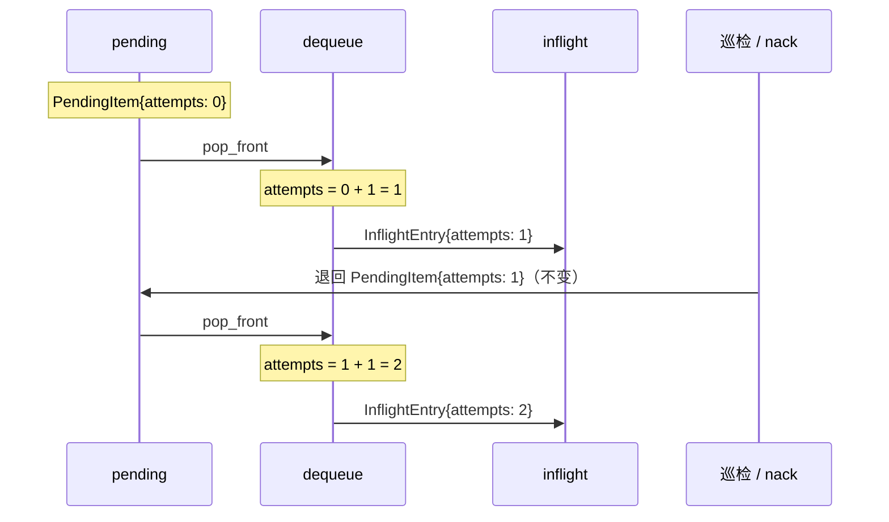
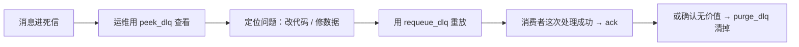
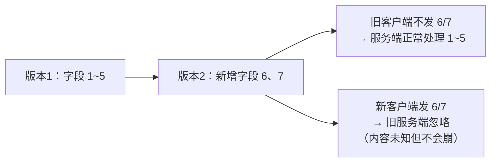
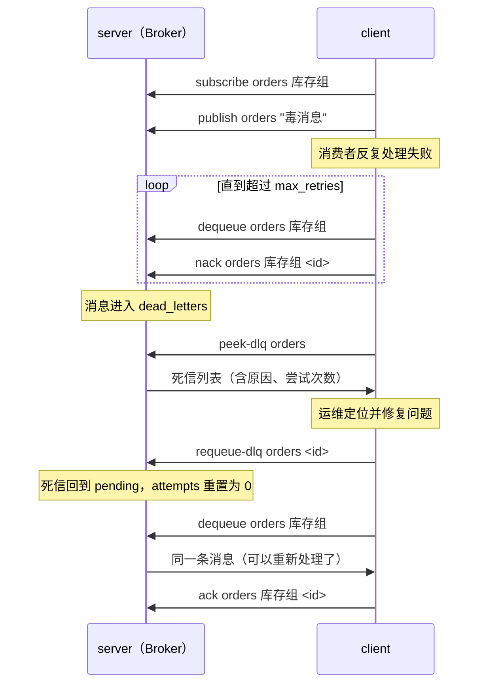

# Mymq-rs 学习文档 第 2.5 阶段：可靠性补完（重试上限 + 死信队列）

> 这份文档是 `LEARNING-2-quic.md` 的**插曲篇**，也是 `LEARNING-3-persistence.md` 的**前置篇**。
>
> 在 `LEARNING.md` 里，你实现了「广播订阅 + 每订阅者独立 ack + 超时重投」。但那份文档留了一个**明显的隐患**：重投是**无限**的。一个永远处理失败的消息（毒消息）会在 `pending` 和 `inflight` 之间来回弹跳，直到进程结束——永远不会被放弃，也永远不会被记录。
>
> 本册要补上这个缺口：**给重投加上限，给失败的消息找一个归宿——死信队列（DLQ）**。
>
> 延续前两份文档的教学方式：**分步引导 + 手动补齐 + 运行验证**，核心逻辑留给你自己写。
>
> 🆕 **为什么单独插一册**：DLQ 不是"顺手加个功能"，它会**改变两处核心数据结构**（`pending` 和 `inflight` 的元素类型）。而第 3 阶段的持久化要**落盘这两处状态**——如果你先做持久化、再补 DLQ，就要把落盘格式推倒重来。**先定形，再落盘**，这是工程上的正确顺序。

---

## 目录

- [第 0 章 前置条件与路线定位](#第-0-章-前置条件与路线定位)
  - [0.1 前置核对清单](#01-前置核对清单)
  - [0.2 本册在路线图中的位置](#02-本册在路线图中的位置)
  - [0.3 本册的依赖地图（重要）](#03-本册的依赖地图重要)
- [第 1 章 概念铺垫：毒消息与死信队列](#第-1-章-概念铺垫毒消息与死信队列)
  - [1.1 你现在的问题：无限重投](#11-你现在的问题无限重投)
  - [1.2 什么是毒消息](#12-什么是毒消息)
  - [1.3 死信队列的通用设计](#13-死信队列的通用设计)
  - [1.4 动手前必须想清楚的三个设计问题](#14-动手前必须想清楚的三个设计问题)
- [第 2 章 数据结构演进（本册核心设计章）](#第-2-章-数据结构演进本册核心设计章)
  - [2.1 为什么现在的结构改不动](#21-为什么现在的结构改不动)
  - [2.2 pending 的元素升级：PendingItem](#22-pending-的元素升级pendingitem)
  - [2.3 inflight 的值升级：InflightEntry](#23-inflight-的值升级inflightentry)
  - [2.4 新增 DeadLetter](#24-新增-deadletter)
  - [2.5 死信槽位放在哪：Topic 而不是 Broker](#25-死信槽位放在哪topic-而不是-broker)
  - [2.6 设计定稿：目标数据结构全貌](#26-设计定稿目标数据结构全貌)
- [第 3 章 分步实现（核心章节）](#第-3-章-分步实现核心章节)
  - [步骤一 结构体化 pending 与 inflight（纯重构）](#步骤一-结构体化-pending-与-inflight纯重构)
  - [步骤二 新增 DeadLetter 与 Topic 的死信槽位](#步骤二-新增-deadletter-与-topic-的死信槽位)
  - [步骤三 max_retries 与投递计次](#步骤三-max_retries-与投递计次)
  - [步骤四 nack 分流：超限入死信](#步骤四-nack-分流超限入死信)
  - [步骤五 redeliver_timeout 分流：跨字段借用难题](#步骤五-redeliver_timeout-分流跨字段借用难题)
  - [步骤六 死信的查询与运维](#步骤六-死信的查询与运维)
  - [步骤七 proto 协议扩展](#步骤七-proto-协议扩展)
  - [步骤八 命令层与客户端适配](#步骤八-命令层与客户端适配)
  - [步骤九 端到端验收](#步骤九-端到端验收)
- [第 4 章 完整扩展路径（更新后的路线地图）](#第-4-章-完整扩展路径更新后的路线地图)
- [最终工程结构总览（收尾核对）](#最终工程结构总览收尾核对)
- [附录 A 调试技巧与本册常见坑](#附录-a-调试技巧与本册常见坑)
- [附录 B 生产级对照表](#附录-b-生产级对照表)

---

## 第 0 章 前置条件与路线定位

### 0.1 前置核对清单

开始前，逐条核对。**任何一条不满足，先回去补齐再往下走**——本册会直接改动这些结构。

| # | 检查项 | 怎么查 | 期望结果 |
|---|--------|--------|----------|
| 1 | `src/broker.rs` 存在且类型已 `pub` | 打开文件 | `pub struct Broker` / `pub struct Topic` / `pub struct SubscriberState` / `pub struct Message` |
| 2 | 现有 2 个单元测试通过 | `cargo test` | 全绿（`ack_nack_isolation`、`redeliver_expired_message`） |
| 3 | lib 名 | 看 `Cargo.toml` 的 `[lib]` | `name = "mymq_rs"` |
| 4 | 编辑版本 | 看 `Cargo.toml` 的 `edition` | `"2024"` |
| 5 | `SubscriberState` 字段 | 打开 `broker.rs` | `pending: VecDeque<Message>`、`inflight: HashMap<u64, (Message, Instant)>` |

> ⚠️ **路径提醒**：本册所有代码里，库名一律写 **`mymq_rs`**，对应 `Cargo.toml` 里的 `[lib] name = "mymq_rs"`。`LEARNING-2-quic.md` 已与本册保持一致（那份文档的早期版本曾写作 `mymq`，现已修正）。

### 0.2 本册在路线图中的位置


### 0.3 本册的依赖地图（重要）

**你不需要等到阶段 2 全部做完才能开始本册。** 本册的九个步骤，依赖关系是这样的：



| 步骤 | 依赖 | 现在能做吗 |
|------|------|-----------|
| 步骤一 ~ 步骤六 | 只依赖 `src/broker.rs` | ✅ **现在就能做** |
| 步骤七 ~ 步骤九 | 依赖阶段 2 的步骤四~八（`proto` 已生成、`handle_command` 已实现、`server.rs`/`client.rs` 能跑） | ⏳ 需要先完成阶段 2 |

> 💡 **建议**：如果你现在在阶段 2 的步骤三附近，**可以先把步骤一~六 做完**（纯内存逻辑，跑单元测试就能验证），再回头把阶段 2 的步骤四~八 补完，最后回到本册的步骤七~九。这样两件事并行推进，互不阻塞。

### 0.4 时间与脱困提示

> ⏱ **本册预计耗时 2–3 小时**。九个步骤都标了「建议耗时」。
>
> 如果某步超过 **40 分钟**还没通过验证，先停下来翻 [附录 A](#附录-a-调试技巧与本册常见坑)。本册最容易卡住的地方是**步骤五的借用检查器报错**——那不是你写错了，是 Rust 的所有权规则在教你一件事，附录里有详细解释。

---

## 第 1 章 概念铺垫：毒消息与死信队列

### 1.1 你现在的问题：无限重投

先把问题摆到台面上。你现在的 `redeliver_timeout` 是这样的：

```rust
// 你现在 broker.rs 里的版本（简化）
for id in expired {
    if let Some((msg, _)) = sub.inflight.remove(&id) {
        sub.pending.push_back(msg);   // ← 无条件放回队尾
    }
}
```

以及你的 `nack`：

```rust
if let Some((msg, _)) = s.inflight.remove(&msg_id) {
    s.pending.push_back(msg);         // ← 同样无条件放回队尾
    return true;
}
```

你自己在代码注释里已经标注了这个隐患：

```rust
/// 重投超时未确认的消息（对每个订阅者自己的 inflight 巡检）
/// 当前没有重试次数上限，会导致一直循环
```

**推演一下后果**：假设「库存扣减」订阅者对某条消息的处理逻辑有个 bug——比如消息体格式是它无法解析的，每次处理都抛错、都 `nack`。那么：

```
pending ──dequeue──▶ inflight ──nack──▶ pending ──dequeue──▶ inflight ──nack──▶ ...
   ▲                                                                        │
   └──────────────────────── 永远循环，直到进程结束 ─────────────────────────┘
```

这条消息会**永远占着队列头部**（因为 `push_back` 到队尾，但如果队列里只有它，它就一直被反复拉取）。更糟的是：它**消耗 CPU**、**刷屏日志**，而且**没有人知道出了问题**——没有告警、没有记录、没有地方去查。

### 1.2 什么是毒消息

业界把这种消息叫 **毒消息（poison message）**：

> **毒消息**：一条因为内容本身有问题（格式错误、引用了不存在的资源、超出了业务规则边界），导致**无论重试多少次都会失败**的消息。

关键区别在这里：

| 失败类型 | 例子 | 重试有意义吗 |
|----------|------|-------------|
| **暂时性失败（transient）** | 下游服务刚好在重启、数据库连接超时、网络抖动 | ✅ 有意义，重试几次就好 |
| **永久性失败（poison）** | 消息体是坏 JSON、引用的商品 ID 不存在、字段缺失 | ❌ **重试一万次也一样失败** |

你的重投机制**只对第一种有效**，对第二种是纯粹的浪费。但麻烦的是：**broker 无法自己判断**一条消息是哪一种——它只能通过"重试了 N 次还是失败"来**推断**这是毒消息。

这就是「重试上限」这个机制的全部逻辑：

> 重试上限的本质，是**用一个次数阈值，去近似判断"这条消息是不是毒消息"**。

### 1.3 死信队列的通用设计

超过上限之后，消息该去哪？三个选择：

| 选择 | 后果 |
|------|------|
| 直接丢弃 | 消息**永久丢失**，出了问题无从排查 ❌ |
| 继续无限重试 | 就是你现在的行为 ❌ |
| **移入死信队列（DLQ）** | 消息被**隔离**，不再干扰正常流程，但**可查、可重放** ✅ |

**死信队列（Dead Letter Queue, DLQ）** 就是"失败消息的隔离区 + 归档区"。它有四个作用：



第 4 条尤其重要：**真实事故里，常见流程是「消息进 DLQ → 运维看到告警 → 修好消费者 bug → 把 DLQ 里的消息重放回去」**。如果没有 DLQ，这条消息就真的没了。

主流 MQ 都有这个机制，只是叫法不同：

| MQ | 机制名 |
|----|--------|
| **RabbitMQ** | `x-dead-letter-exchange`（死信交换机 DLX） |
| **Kafka** | 没有内建，靠**约定**：应用自己发到 `<topic>.DLQ` |
| **RocketMQ** | `%DLQ%<consumerGroup>`（内建，自动创建） |
| **SQS** | Redrive Policy + Dead Letter Queue（内建） |

> 📖 **注意 Kafka 那一行**：Kafka 官方**没有**内建 DLQ。这不是因为它不需要，而是因为 Kafka 的核心抽象是"日志"，它不管理消费者的失败——失败处理被推给了应用层。**这正好说明 DLQ 是一个"语义层"的能力，而不是"存储层"的能力**——所以本册改的全是 `broker.rs` 的语义逻辑，跟存储无关。

### 1.4 动手前必须想清楚的三个设计问题

在写代码前，把这三个问题想明白，后面九个步骤都会顺。

**问题一：重试上限按谁计数？**

答案是：**按「消息 × 订阅者」计数，不是按消息全局计数。**

为什么？因为你的模型是**广播**：同一条消息被复制给了 N 个订阅者，各自独立处理。如果按全局计数，那么「订单推送」失败 3 次就会让「库存扣减」那份也一起进死信——这是错的。

```
消息 M1（全局 id = 1）
  ├── 副本 → 订单推送：失败 1 次
  ├── 副本 → 库存扣减：失败 3 次 → 这一份进死信
  └── 副本 → 报表分析：成功 0 次
```

> 所以**重试次数必须记录在"每个订阅者各自的 pending/inflight 里"**，而不是记在 `Message` 上。这是本册数据结构设计的第一条约束，它会直接推翻一个"看起来很自然"的做法（把 attempts 塞进 `Message`）。

**问题二：nack 算不算一次失败？**

必须算。否则会出现这种情况：

```
消费者：我处理失败了 → nack
broker：好的，放回队尾
消费者：我处理失败了 → nack
broker：好的，放回队尾
... 无限循环，只是走的 nack 路径而不是超时路径
```

「无限重投」的 bug 在 `nack` 和 `redeliver_timeout` **两条路径上都存在**，所以本册两条都要修（步骤四、步骤五）。

> 📖 那 `nack` 和超时有什么区别？区别在**谁触发的**：`nack` 是消费者**主动承认失败**，超时是消费者**失联**（崩溃、卡死）。两者都算一次失败尝试，但**将来**你可以给它们不同的上限（比如超时按 3 次算，显式 nack 按 1 次算——因为显式 nack 通常意味着永久性错误）。本册先统一处理。

**问题三：DLQ 是全局一个，还是每个 topic 一个？**

| 方案 | 优点 | 缺点 |
|------|------|------|
| 全局一个 `Vec<DeadLetter>` | 实现最简单 | 所有 topic 的死信混在一起，排查时难分辨；将来落盘也难按 topic 隔离 |
| **每个 topic 一个**（本册采用） | 与"topic 是消息分类"的心智一致；落盘时天然按 topic 组织；对应 RabbitMQ 的"每个队列自己配 DLX" | 稍微多一点结构 |

**本册采用「每个 topic 一个」**，理由在第 3 阶段会兑现：持久化时，你可以把「topic → 它的所有订阅者状态 → 它的死信」作为一个整体来读写，天然聚簇。

---

## 第 2 章 数据结构演进（本册核心设计章）

本章不写逻辑，只定数据结构。**这一步想清楚，第 3 章的九个步骤就是水到渠成。**

### 2.1 为什么现在的结构改不动

看你现在这两个字段：

```rust
pub struct SubscriberState {
    pub pending: VecDeque<Message>,
    pub inflight: HashMap<u64, (Message, Instant)>,
}
```

问题在于：**它丢掉了「这条消息投递了几次」这个信息。**

- `pending` 里只有 `Message`——消息被 `nack` 退回后，它**不记得自己之前失败过几次**
- `inflight` 是一个 `(Message, Instant)` 元组——只存了消息和投递时间，同样没有次数

所以你要加计次，就必须**改这两个元素的类型**。这就是本册被称为"结构演进"的原因：

> 加一个功能，往往不是"加一个函数"，而是"发现旧的数据结构表达力不够，先升级它"。

### 2.2 pending 的元素升级：PendingItem

```rust
/// pending 队列里的元素：消息 + 它已经被投递过几次
#[derive(Clone)]
pub struct PendingItem {
    pub msg: Message,
    /// 已经投递过几次（刚发布时为 0，第一次 dequeue 后变 1）
    pub attempts: u32,
}
```

**为什么 attempts 放在 pending 里而不是 `Message` 里？**

回到 1.4 的问题一：attempts 是**每个订阅者各自**的。`Message` 是**被复制给多个订阅者的公共对象**（虽然 `Clone` 之后各是各的，但语义上它代表"这一条消息"），把 per-subscriber 的临时状态塞进去会污染它的语义。而且阶段 2 里 `Message` 要转成 protobuf 发给客户端——客户端不需要知道内部重试了几次。

> 📖 **`attempts` 的语义约定**：它的含义是**「已经被投递过几次」**，而不是「还剩几次机会」。所以：
> - `publish` 时 = `0`（还没投递过）
> - `dequeue` 时 = 原值 `+ 1`（这一次投递了）
> - `nack`/超时回队时 = **保持原值**（不重置、不递减）
>
> 判定超限的时机是「**准备再次投递之前**」：如果 `attempts >= max_retries`，就不投了，直接进死信。
>
> 用 `max_retries = 3` 推演一遍（步骤三、四、五会反复用到这张表）：
>
> | 动作 | pending 里的 attempts | inflight 里的 attempts | 是否进死信 |
> |------|----------------------|----------------------|-----------|
> | publish | 0 | —— | 否 |
> | dequeue ① | —— | 1 | 否 |
> | nack ① | 1 | —— | 否（1 < 3） |
> | dequeue ② | —— | 2 | 否 |
> | nack ② | 2 | —— | 否（2 < 3） |
> | dequeue ③ | —— | 3 | 否 |
> | nack ③ | —— | —— | ✅ **是（3 >= 3）** |
>
> 结论：`max_retries = 3` 意味着**最多投递 3 次**，第 3 次失败后进死信。

### 2.3 inflight 的值升级：InflightEntry

```rust
/// inflight 里的条目：消息 + 投递时刻 + 尝试次数
pub struct InflightEntry {
    pub msg: Message,
    /// 投递时刻，用于超时判定（替换掉原来的元组第二位）
    pub delivered_at: Instant,
    /// 已经投递过几次
    pub attempts: u32,
}
```

**为什么用命名结构体，而不是继续堆元组 `(Message, Instant, u32)`？**

这是 Rust 里一个很实际的取舍。三个字段的元组还能忍，但：

1. **可读性**：`entry.0` / `entry.1` / `entry.2` 完全不知道是什么；`entry.attempts` 一眼就懂
2. **可扩展性**：将来要加"最后一次失败原因"、"消费者标识"时，结构体加字段不影响已有代码；元组加元素会让所有 `entry.0` 之类的访问全部错位
3. **可维护性**：编译器会帮你检查字段名，元组只检查位置

> 📖 **经验法则**：字段数 **≥ 3**，或者字段**语义不显然**（比如两个都是 `u64`，一个是 id 一个是次数），就应该用命名结构体。元组只适合 `(K, V)` 这种一眼能懂的配对。

⚠️ **注意这个改动会破坏现有测试**：你 `main.rs` 里的 `redeliver_expired_message` 测试里有这么一段：

```rust
if let Some((_, at)) = state.inflight.get_mut(&msg.id) {
    *at = Instant::now() - Duration::from_secs(60);
}
```

元组解构 `(_, at)` 在结构体上会编译失败。这是**故意的**——步骤一就是要你亲手修它，体会"重构会波及调用方"这件事。

### 2.4 新增 DeadLetter

```rust
/// 死信原因
#[derive(Clone, Debug, PartialEq)]
pub enum DeadLetterReason {
    /// 重试次数超过上限
    MaxRetries,
}

/// 一封死信：出问题的消息 + 完整的失败现场
#[derive(Clone)]
pub struct DeadLetter {
    /// 那条没能被处理成功的消息
    pub msg: Message,
    /// 它原本属于哪个订阅者（重放时要还回去）
    pub subscriber: String,
    /// 进死信时已经尝试了多少次
    pub attempts: u32,
    /// 为什么进的死信
    pub reason: DeadLetterReason,
}
```

**为什么 `reason` 用枚举而不是 `String`？**

- 枚举是**编译期受检**的：你写 `DeadLetterReason::MaxReties`（拼错）编译器会报错；写 `"maxReties"` 字符串则要等到运行时才发现
- 只有三种可能时，枚举比字符串更省空间
- **只有跨协议传输时**（步骤七的 protobuf），才需要转成 `String`——因为 protobuf 的枚举和 Rust 枚举互转有摩擦

> 📖 **这是"内部用类型，边界用字符串"的通用模式**：核心逻辑内部用强类型（枚举），一旦要过网络/存文件，才降级成宽松类型（字符串）。阶段 3 落盘时你会再次遇到这个抉择。

**注意 `DeadLetter` 里没有 `topic` 字段**——因为死信将存在 `Topic` 内部（见 2.5），topic 是隐含的，不必重复存储。

### 2.5 死信槽位放在哪：Topic 而不是 Broker

这是本册**最重要的一个设计决策**，因为它决定了步骤五会不会卡死。

**方案 A：放在 Broker 上**（❌ 不采用）

```rust
pub struct Broker {
    pub topics: HashMap<String, Topic>,
    pub dead_letters: HashMap<String, VecDeque<DeadLetter>>,  // topic -> 死信
    // ...
}
```

**方案 B：放在 Topic 上**（✅ 采用）

```rust
pub struct Topic {
    pub subscribers: HashMap<String, SubscriberState>,
    pub dead_letters: VecDeque<DeadLetter>,   // 本 topic 的死信
}
```

看起来两个都能用，但**在步骤五会分出生死**。原因在于 Rust 的借用检查：

`redeliver_timeout` 需要遍历 `topic.subscribers`，同时在发现超限时**往死信槽位写东西**。

- **方案 A 下**：你要同时可变借用 `self.topics`（遍历订阅者）和 `self.dead_letters`（写死信）。虽然 Rust 支持同一个结构体的**不同字段**分别借用，但你遍历 `self.topics.values_mut()` 时拿到的是 `&mut Topic`，此时想再取 `&mut self.dead_letters` 就会撞上"`self` 已被可变借用"的墙——**编译不过**。
- **方案 B 下**：遍历 `topic.subscribers` 和写 `topic.dead_letters` 都在**同一个 `&mut Topic` 内部**。Rust 允许分时借用 `t.subscribers`（先）和 `t.dead_letters`（后），只要不重叠就行。**编译得过**。

> 💡 **一句话记住**：**把会在同一个函数里被"边遍历边修改"的数据，放进同一个结构体里。** 这样借用检查器只需要你保证"分时"，而不是"跨字段"，代码会好写非常多。
>
> 这是 Rust 工程里一条非常实用的设计直觉——**数据结构的设计要顺着借用检查器的规则走**。

### 2.6 设计定稿：目标数据结构全貌

第 3 章的所有步骤，都朝这个终态收敛。**建议先把它抄在纸上**：



**状态机也新增了一条边**——这就是本册要实现的核心变化：



---

## 第 3 章 分步实现（核心章节）

> ⚠️ **本册改动集中在 `src/broker.rs`**，步骤七起会波及 `proto/mq.proto`、`src/bin/server.rs`、`src/bin/client.rs`。
> 每步都遵循「目标 / 概念讲解 / 实现提示 / 请你动手 / 验证方式 / ⚠️ 踩坑预警」结构。

---

### 步骤一 结构体化 pending 与 inflight（纯重构）

> ⏱ **建议耗时**：20–30 分钟

**本步目标**：把 `pending` 的元素和 `inflight` 的值从"裸类型"升级为结构体，**不改变任何行为**。

**概念讲解**：

这一步叫**纯重构（pure refactor）**：只改数据结构，不改逻辑。它的价值是给你一个**安全的中间状态**——做完之后，所有现有测试应该**依然全绿**。如果测试红了，说明你重构时不小心改了行为，可以立刻定位。

**实现提示**：

在 `src/broker.rs` 里，找到 `Message` 定义的下方，加入两个新结构体：

```rust
/// pending 队列里的元素：消息 + 已经投递过几次
#[derive(Clone)]
pub struct PendingItem {
    pub msg: Message,
    pub attempts: u32,
}

/// inflight 里的条目：消息 + 投递时刻 + 尝试次数
pub struct InflightEntry {
    pub msg: Message,
    pub delivered_at: Instant,
    pub attempts: u32,
}
```

然后把 `SubscriberState` 的两个字段类型换掉：

```rust
pub struct SubscriberState {
    pub pending: VecDeque<PendingItem>,               // 原来是 VecDeque<Message>
    pub inflight: HashMap<u64, InflightEntry>,        // 原来是 HashMap<u64, (Message, Instant)>
}
```

**请你动手**：改完结构体后，编译器会把所有需要同步修改的地方**逐个报给你**（这就是静态类型语言的好处）。按报错顺序修，一共四处：

1. **`publish`**：`push_back(msg.clone())` → 要包成 `PendingItem`
2. **`dequeue`**：`pop_front()` 拿到的现在是 `PendingItem`；插入 `inflight` 时要构造 `InflightEntry`，其中 `attempts` 取 `item.attempts + 1`（这一步先写对，步骤三会解释为什么是 +1）
3. **`nack`**：`inflight.remove()` 拿到的现在是 `InflightEntry`；回队时要重新包成 `PendingItem`
4. **`redeliver_timeout`**：`filter` 里访问投递时间要用 `e.delivered_at`，不再是 `(_, (_, at))` 这种元组解构

`redeliver_timeout` 的 `filter` 一行可以这样改（其余保持原样）：

```rust
.filter(|(_, e)| e.delivered_at.elapsed() > timeout)
```

**验证方式**：

1. 先修 `main.rs` 里被破坏的测试——`redeliver_expired_message` 中的元组解构：

```rust
// 旧写法（会编译失败）
// if let Some((_, at)) = state.inflight.get_mut(&msg.id) {
//     *at = Instant::now() - Duration::from_secs(60);
// }

// 新写法
if let Some(entry) = state.inflight.get_mut(&msg.id) {
    entry.delivered_at = Instant::now() - Duration::from_secs(60);
}
```

2. 运行 `cargo test`，**两个测试必须全绿**。

> ⚠️ **踩坑预警**
>
> - **测试红了怎么办**：如果 `redeliver_expired_message` 失败，最可能是 `dequeue` 里 `attempts` 写错了（比如写成了 `item.attempts` 而不是 `+ 1`）——本步虽然叫"不改行为"，但 `attempts` 的初值语义要在这一步就定下来，否则步骤三会混乱。
> - **`Instant` 的导入**：`InflightEntry` 用到了 `Instant`，确认 `broker.rs` 顶部有 `use std::time::{Duration, Instant};`（你原来的 `SubscriberState` 已经从 `std::time::Instant` 引了，但改为顶层 `use` 更清爽）。
> - **`Clone` 的边界**：`PendingItem` 需要 `#[derive(Clone)]`（`publish` 里要克隆给多个订阅者）；`InflightEntry` **不需要** `Clone`（它只在 `remove()` 时被整体转移所有权）。多余的 `Clone` 不是错误，但会暴露"你没想清楚它怎么流转"。
> - **别急着加 `DeadLetter`**：那是步骤二的事。一步一个概念，每步都能编译能测试，是本套教程的核心节奏。

---

### 步骤二 新增 DeadLetter 与 Topic 的死信槽位

> ⏱ **建议耗时**：15–20 分钟

**本步目标**：定义死信类型，并给 `Topic` 加上死信存储。

**概念讲解**：

这一步只加"容器"，不加"逻辑"——还没有任何代码会往死信里放东西。这是**自上而下的设计推进**：先把数据的地基打好，再写搬运数据的逻辑。

**实现提示**：

加入两个类型（放在 `SubscriberState` 附近）：

```rust
/// 死信原因
#[derive(Clone, Debug, PartialEq)]
pub enum DeadLetterReason {
    /// 重试次数超过上限
    MaxRetries,
}

/// 一封死信：出问题的消息 + 失败现场
#[derive(Clone)]
pub struct DeadLetter {
    /// 那条没能被处理成功的消息
    pub msg: Message,
    /// 它原本属于哪个订阅者（重放时要还回去）
    pub subscriber: String,
    /// 进死信时已经尝试了多少次
    pub attempts: u32,
    /// 为什么进的死信
    pub reason: DeadLetterReason,
}
```

给 `Topic` 加字段：

```rust
pub struct Topic {
    pub subscribers: HashMap<String, SubscriberState>,
    /// 本 topic 的死信队列
    pub dead_letters: VecDeque<DeadLetter>,
}
```

并同步 `Topic::new()`：

```rust
impl Topic {
    pub fn new() -> Self {
        Topic {
            subscribers: HashMap::new(),
            dead_letters: VecDeque::new(),
        }
    }
}
```

**请你动手**：加入上面三处修改，然后 `cargo check`。

**验证方式**：`cargo check` 通过，`cargo test` 依然全绿（本步没有改变任何运行时行为）。

> ⚠️ **踩坑预警**
>
> - **`Self` 的写法**：`Topic::new()` 里可以写 `Topic { ... }`，也可以写 `Self { ... }`。既然项目里已有 `Broker::new` 用的是显式类型名，保持风格一致即可。
> - **`DeadLetterReason` 为什么要 `PartialEq`**：因为步骤九的测试里要 `assert_eq!(dl.reason, DeadLetterReason::MaxRetries)`。`Debug` 是为了 `assert!` 失败时能打印出来。**测试友好性也是类型设计的一部分**——加 derive 时顺手想一想"测试会不会用到"。
> - **为什么 `VecDeque` 而不是 `Vec`**：死信也需要 FIFO（先进先出），而且 `VecDeque` 的 `pop_front`/`remove(pos)` 都很好用。和 `pending` 保持一致。

---

### 步骤三 max_retries 与投递计次

> ⏱ **建议耗时**：20–30 分钟

**本步目标**：给 `Broker` 加上可配置的重试上限，并让每次 `dequeue` 都给消息的 `attempts` 加一。

**概念讲解**：

上一步说过，`attempts` 的语义是「**已经被投递过几次**」。那么**唯一**让它自增的地方就是 `dequeue`——因为只有 `dequeue` 才是一次"投递"。`nack` 和超时巡检都**不改动** `attempts`（它们只是把消息退回去，让下一次 `dequeue` 再去自增）。

这一点很关键，画一遍时序：



**实现提示**：

给 `Broker` 加字段，并把 `new` 拆成两个：

```rust
pub struct Broker {
    pub topics: HashMap<String, Topic>,
    pub next_id: u64,
    pub notifier: Arc<tokio::sync::Notify>,
    /// 单条消息对单个订阅者的最大投递次数
    pub max_retries: u32,
}

impl Broker {
    /// 默认上限 3 次
    pub fn new() -> Self {
        Self::with_max_retries(3)
    }

    /// 自定义上限（测试时很有用）
    pub fn with_max_retries(max_retries: u32) -> Self {
        Broker {
            topics: HashMap::new(),
            // 初值 0 + 「先自增再返回」⇒ 首条 id = 1；
            // 不要和 LEARNING.md 的「初值 1 + 先返回再自增」混用，否则首条 id 会变成 0
            // （0 在 proto3 里是默认值，会被当成「没有消息」的隐式哨兵）
            next_id: 0,
            notifier: Arc::new(tokio::sync::Notify::new()),
            max_retries,
        }
    }
}
```

`dequeue` 是本步的逻辑核心（步骤一你可能已经写对了，这里给出标准形态）：

```rust
/// 某订阅者拉取一条自己的消息（从 pending 队首取，移入 inflight）
pub fn dequeue(&mut self, topic: &str, sub: &str) -> Option<Message> {
    let state = self.topics.get_mut(topic)?.subscribers.get_mut(sub)?;
    let item = state.pending.pop_front()?;
    let attempts = item.attempts + 1;          // ← 本次投递，次数 +1
    state.inflight.insert(
        item.msg.id,
        InflightEntry {
            msg: item.msg.clone(),
            delivered_at: Instant::now(),
            attempts,
        },
    );
    Some(item.msg)
}
```

**请你动手**：

1. 加 `max_retries` 字段，实现 `new` / `with_max_retries`
2. 确认 `dequeue` 里的 `attempts = item.attempts + 1`
3. 确认 `publish` 时构造的 `PendingItem { attempts: 0 }`

**验证方式**：

在 `src/main.rs` 末尾的 `#[cfg(test)] mod tests` 里加一个测试（**现有两个测试就在这个文件里**，`broker.rs` 目前还没有测试模块），直接检查 `inflight` 里的 `attempts`：

```rust
#[tokio::test]
async fn dequeue_increases_attempts() {
    let mut b = Broker::new();
    b.subscribe("orders", "A");
    b.publish("orders", "测试".into());

    let msg = b.dequeue("orders", "A").unwrap();
    let attempts = b
        .topics
        .get("orders").unwrap()
        .subscribers.get("A").unwrap()
        .inflight.get(&msg.id).unwrap()
        .attempts;
    assert_eq!(attempts, 1);          // 第一次投递
}
```

运行 `cargo test`，全绿。

> ⚠️ **踩坑预警**
>
> - **别在 `publish` 里写 `attempts: 1`**：这是最容易搞错的地方。`publish` 只是把消息**放进队列**，还没有投递，所以是 `0`。
> - **`Default` trait 的诱惑**：你可能会想给 `Broker` 实现 `Default` 以便写 `Broker::default()`。可以，但注意 `Default::default()` 的 `max_retries` 会是 `0`，意味着**第一条消息第一次失败就进死信**——这是危险的默认值。**要么不实现 `Default`，要么手动实现并给出合理的默认值**。这个细节说明：`#[derive(Default)]` 在字段有"安全默认值"要求时会坑人。
> - **`max_retries = 0` 会怎样**：推演一下——`publish` 后 `pending` 里是 `attempts: 0`，第一次 `dequeue` 变成 `1`，第一次失败时 `1 >= 0` 成立，直接进死信。也就是说 `0` 表示"不允许投递失败一次"。这是个合法的配置，但要想清楚它是否符合直觉。

---

### 步骤四 nack 分流：超限入死信

> ⏱ **建议耗时**：25–35 分钟

**本步目标**：让 `nack` 在 `attempts >= max_retries` 时把消息送进死信，否则才回 `pending`。

**概念讲解**：

这是本册第一个"真正的逻辑改动"。核心是一个**两路分流**：

```
nack(topic, sub, msg_id)
    │
    ├─ 从 inflight 取出 entry
    │
    ├─ entry.attempts >= max_retries ?
    │       ├─ 是 → 放进 topic.dead_letters
    │       └─ 否 → 放回 sub.pending（attempts 保持）
    │
    └─ 返回 true
```

**为什么必须先 `remove` 出来再判断，而不是先判断再 `remove`？**

因为 Rust 的借用规则：只要你还在持有 `sub` 的借用（`get_mut` 返回的 `&mut SubscriberState`），就不能同时去可变借用 `topic.dead_letters`。而 `remove()` 会把整个 `InflightEntry` **转移出所有权**，借用就此结束，之后就可以自由访问 `topic` 的其他字段了。

> 📖 **这是 Rust 里最常用的解题套路之一**：**「先 `remove` 取所有权，再处理去向」**。一旦数据被取出来成为局部变量，它就不再借用任何东西，你就能自由地把它放到任何地方。记住这个模式，它在整个项目里会反复出现（阶段一的 `redeliver_timeout` 是它的另一个变体）。

**实现提示**（完整参考）：

```rust
/// 拒绝消息：失败时要么重投，要么超限进死信
pub fn nack(&mut self, topic: &str, sub: &str, msg_id: u64) -> bool {
    let max_retries = self.max_retries;                   // 先取出，避免后续借用冲突
    let Some(t) = self.topics.get_mut(topic) else {
        return false;
    };

    // 第一步：把条目「整条取出来」——这一步结束后，对 t.subscribers 的借用就结束了
    let Some(entry) = t
        .subscribers
        .get_mut(sub)
        .and_then(|s| s.inflight.remove(&msg_id))
    else {
        return false;                                     // 消息不在 inflight 里
    };

    // 第二步：决定它去哪
    if entry.attempts >= max_retries {
        // 超限：进死信，保留失败现场
        t.dead_letters.push_back(DeadLetter {
            msg: entry.msg,
            subscriber: sub.to_string(),
            attempts: entry.attempts,
            reason: DeadLetterReason::MaxRetries,
        });
    } else {
        // 未超限：放回 pending 队尾，attempts 保持（下次 dequeue 会 +1）
        if let Some(s) = t.subscribers.get_mut(sub) {
            s.pending.push_back(PendingItem {
                msg: entry.msg,
                attempts: entry.attempts,
            });
        }
    }
    true
}
```

**请你动手**：按上面的形态重写 `nack`。

**验证方式**：加两个测试，覆盖**分流的两边**——这就是所谓的"边界测试"（一个刚够、一个刚不够）：

```rust
#[tokio::test]
async fn nack_retries_until_limit_then_dead_letters() {
    let mut b = Broker::with_max_retries(3);
    b.subscribe("orders", "A");
    b.publish("orders", "毒消息".into());

    // 前两次失败：还在重投（attempts 1→2）
    for _ in 0..2 {
        let msg = b.dequeue("orders", "A").unwrap();
        assert!(b.nack("orders", "A", msg.id));
        assert_eq!(b.topics.get("orders").unwrap().dead_letters.len(), 0);
    }

    // 第三次失败：超限，进死信
    let msg = b.dequeue("orders", "A").unwrap();
    assert!(b.nack("orders", "A", msg.id));

    let t = b.topics.get("orders").unwrap();
    let s = t.subscribers.get("A").unwrap();
    assert_eq!(s.pending.len(), 0, "不应再留在 pending");
    assert!(s.inflight.is_empty(), "不应再留在 inflight");
    assert_eq!(t.dead_letters.len(), 1);
    assert_eq!(t.dead_letters[0].attempts, 3);
    assert_eq!(t.dead_letters[0].subscriber, "A");
    assert_eq!(t.dead_letters[0].reason, DeadLetterReason::MaxRetries);
}

#[tokio::test]
async fn nack_under_limit_stays_pending() {
    let mut b = Broker::with_max_retries(3);
    b.subscribe("orders", "A");
    b.publish("orders", "普通消息".into());

    // 只失败一次
    let msg = b.dequeue("orders", "A").unwrap();
    assert!(b.nack("orders", "A", msg.id));

    let t = b.topics.get("orders").unwrap();
    assert_eq!(t.subscribers.get("A").unwrap().pending.len(), 1, "应回到 pending 等待重试");
    assert_eq!(t.dead_letters.len(), 0, "还没超限，不该产生死信");
}
```

> 💡 **测试设计的小技巧**：这两个测试的名字里，`..._then_dead_letters` 和 `_under_limit_stays_pending` 已经把预期行为写在名字里了。**测试名应该能当文档读**——将来你（或别人）看到测试列表，就知道系统承诺了什么行为。

> ⚠️ **踩坑预警**
>
> - **`and_then` 链式写法读不懂的话**：可以拆成两步，语义完全等价：
>   ```rust
>   let entry = t.subscribers.get_mut(sub).and_then(|s| s.inflight.remove(&msg_id));
>   let Some(entry) = entry else { return false; };
>   ```
> - **`msg_id` 不在 `inflight` 里怎么处理**：本实现返回 `false`（你没 nack 过它、或者已经 ack 了）。这是"幂等性"的设计选择——**重复 nack 同一条消息不会产生第二封死信**。
> - **别把 `max_retries` 的判断写在 `get_mut(sub)` 之前**：那样你会先借住 `sub`，再去访问 `t.dead_letters`，编译器会拒绝。**先 remove，后分流**。

---

### 步骤五 redeliver_timeout 分流：跨字段借用难题

> ⏱ **建议耗时**：35–50 分钟

**本步目标**：让超时巡检也走上"分流"逻辑，但这次会遇到一个**真正的借用检查器难题**。

**概念讲解**：

先看这一步为什么难。`redeliver_timeout` 的结构是**双层循环**：

```rust
for topic in self.topics.values_mut() {          // 第一层：拿到 &mut Topic
    for sub in topic.subscribers.values_mut() { // 第二层：拿到 &mut SubscriberState
        // ← 在这里，topic.subscribers 被可变借用了
        // ← 但我们还想往 topic.dead_letters 写东西！
    }
}
```

**冲突点**：`for sub in topic.subscribers.values_mut()` 这个循环**整个循环体期间**都持有对 `topic.subscribers` 的可变借用。而在循环体内部，你想执行 `topic.dead_letters.push_back(...)`——这是对 `topic` 的**第二次**借用。**编译不过。**

这跟阶段一那个"先 `collect` 再删"的坑是**同一类问题，但升了一级**：

| 阶段一的问题 | 本步的问题 |
|-------------|-----------|
| 在遍历 `inflight` 的同时 `remove` 它 | 在遍历 `subscribers` 的同时写 `dead_letters` |
| 解法：先 `collect` 出要删的 id，循环结束后再删 | 解法：先 `collect` 出要进死信的条目，循环结束后再写 |
| 同一个字段内部 | **跨字段** |

> 📖 **通用套路**：**「凡是"边遍历边修改另一个容器"的场景，都拆成"收集 → 处理"两个阶段。」** 第一阶段只读/只搬出数据，不碰目标容器；第二阶段在遍历结束后，把收集到的数据写进目标容器。

**实现提示**（完整参考）：

```rust
/// 重投超时未确认的消息：未超限的回 pending，超限的进死信
pub fn redeliver_timeout(&mut self, timeout: Duration) {
    let max_retries = self.max_retries;
    for topic in self.topics.values_mut() {
        // ===== 第一阶段：只遍历 subscribers，把该走的条目「搬出来」 =====
        // 注意：这里绝不能碰 topic.dead_letters
        let mut to_dead: Vec<(String, InflightEntry)> = Vec::new();

        for (sub_name, sub) in topic.subscribers.iter_mut() {
            // 先收集超时的 id（沿用阶段一的技巧）
            let expired: Vec<u64> = sub
                .inflight
                .iter()
                .filter(|(_, e)| e.delivered_at.elapsed() > timeout)
                .map(|(id, _)| *id)
                .collect();

            for id in expired {
                if let Some(entry) = sub.inflight.remove(&id) {
                    if entry.attempts >= max_retries {
                        // 超限：先记账，等会儿统一写
                        to_dead.push((sub_name.clone(), entry));
                    } else {
                        // 未超限：放回 pending（这在 sub 内部，不涉及 topic 的其他字段）
                        sub.pending.push_back(PendingItem {
                            msg: entry.msg,
                            attempts: entry.attempts,
                        });
                    }
                }
            }
        }

        // ===== 第二阶段：subscribers 的借用已结束，现在可以安全写 dead_letters =====
        for (sub_name, entry) in to_dead {
            topic.dead_letters.push_back(DeadLetter {
                msg: entry.msg,
                subscriber: sub_name,
                attempts: entry.attempts,
                reason: DeadLetterReason::MaxRetries,
            });
        }
    }
}
```

**请你动手**：按上面的形态重写 `redeliver_timeout`。**写完后先别急着跑，先自己回答一个问题**：

> 为什么 `sub.pending.push_back(...)` 可以写在第一阶段里，而 `topic.dead_letters.push_back(...)` 不行？

<details>
<summary>（想清楚后再展开）</summary>

因为 `sub` 是从 `topic.subscribers` 借出来的 `&mut SubscriberState`，访问 `sub.pending` 是**在同一个借用内部**操作，合法。

而 `topic.dead_letters` 是 `topic` 的**另一个字段**，在 `topic.subscribers` 被借用的期间去动它，就是**第二次借用 `topic`**，违反"同一时刻只能有一个可变借用"。

> ⚠️ 注意：Rust 其实支持"**同一结构体的不同字段分别可变借用**"（叫 disjoint field borrows）。但这里的问题是：`for sub in topic.subscribers.values_mut()` 这个迭代器**借住的是 `topic.subscribers` 这个字段**，而 `topic.dead_letters` 是另一个字段——理论上应该允许！
>
> 但**在循环体内部**，迭代器仍然活着（它还不知道有没有下一条），所以 `topic.subscribers` 的借用尚未结束。此时 `topic.dead_letters.push_back(...)` 需要 `&mut topic`——而 `topic` 已经被部分借出去了（借给了迭代器），Rust 不允许在"部分借用"的同时再整体借用。所以编译失败。
>
> 拆成两阶段后，第一阶段结束时迭代器被 drop，`topic.subscribers` 的借用彻底结束，第二阶段就能自由借用 `topic.dead_letters` 了。

</details>

**验证方式**：写一个"超时导致进死信"的测试。这里有两个技巧：

- 沿用阶段一的技巧：手动把 `delivered_at` 改成 60 秒前
- 把 `max_retries` 设为 `1`，让测试路径最短

```rust
#[tokio::test]
async fn timeout_beyond_limit_goes_to_dead_letters() {
    let mut b = Broker::with_max_retries(1);   // 只允许投递 1 次
    b.subscribe("orders", "A");
    b.publish("orders", "会超时的消息".into());

    // 拉取，但不 ack，模拟消费者卡死
    let msg = b.dequeue("orders", "A").unwrap();

    // 把投递时间改成 60 秒前，制造「超时」
    let state = b.topics.get_mut("orders").unwrap().subscribers.get_mut("A").unwrap();
    if let Some(entry) = state.inflight.get_mut(&msg.id) {
        entry.delivered_at = Instant::now() - Duration::from_secs(60);
    }

    // 用 1 秒阈值巡检：attempts=1 >= max_retries=1 → 应进死信
    b.redeliver_timeout(Duration::from_secs(1));

    let t = b.topics.get("orders").unwrap();
    assert!(t.subscribers.get("A").unwrap().pending.is_empty(), "超限不应回 pending");
    assert!(t.subscribers.get("A").unwrap().inflight.is_empty());
    assert_eq!(t.dead_letters.len(), 1);
    assert_eq!(t.dead_letters[0].attempts, 1);
}
```

再补一个"未超限正常重投"的测试（把 `max_retries` 设成 `3`，走一遍超时回队）：

```rust
#[tokio::test]
async fn timeout_under_limit_goes_back_to_pending() {
    let mut b = Broker::with_max_retries(3);
    b.subscribe("orders", "A");
    b.publish("orders", "正常超时消息".into());
    let msg = b.dequeue("orders", "A").unwrap();

    let state = b.topics.get_mut("orders").unwrap().subscribers.get_mut("A").unwrap();
    if let Some(entry) = state.inflight.get_mut(&msg.id) {
        entry.delivered_at = Instant::now() - Duration::from_secs(60);
    }
    b.redeliver_timeout(Duration::from_secs(1));

    let t = b.topics.get("orders").unwrap();
    let s = t.subscribers.get("A").unwrap();
    assert_eq!(s.pending.len(), 1, "未超限应回 pending");
    assert_eq!(s.pending[0].attempts, 1, "attempts 应保持为 1，等下次 dequeue 再 +1");
    assert!(t.dead_letters.is_empty());
}
```

> ⚠️ **踩坑预警**
>
> - **报错 `cannot borrow topic.dead_letters as mutable because it is also borrowed as immutable`**（或类似）：说明你还在第一阶段里写 `dead_letters`。回到"两阶段"结构。
> - **报错 `cannot move out of ...`**：可能是 `to_dead.push((sub_name, entry))` 里 `sub_name` 忘了 `.clone()`。它现在是 `&String`（借来的），必须克隆成 `String`。
> - **`for (sub_name, sub) in topic.subscribers.iter_mut()` 的键类型**：`iter_mut()` 产出 `(&String, &mut SubscriberState)`，所以 `sub_name` 是 `&String`。
> - **阶段一的测试会不会被破坏**：`redeliver_expired_message` 里 `max_retries` 默认是 `3`，只巡检一次（attempts=1 < 3），所以行为不变，应该依然全绿。**这是一个很好的"回归验证"**——如果你把它改红了，说明分流写错了。
> - **别把 `to_dead` 定义在 topic 循环外面**：它必须在**每个 topic 内部**重新创建，否则会把上个 topic 的死信写到下个 topic 去。这个 bug 很隐蔽，测试时用一个有两个 topic 的场景能抓出来。

---

### 步骤六 死信的查询与运维

> ⏱ **建议耗时**：25–35 分钟

**本步目标**：提供四个"运维接口"——查看死信、重放死信、清空死信、统计条数。

**概念讲解**：

死信如果**只能进不能出**，那就只是一个垃圾桶，运维价值有限。真正有用的是**闭环**：



本步的四个方法：

| 方法 | 作用 | 关键设计点 |
|------|------|-----------|
| `peek_dlq(topic)` | 查看某 topic 的死信列表 | 返回**克隆**，不暴露内部引用 |
| `dlq_len(topic)` | 死信条数 | 给统计/监控用 |
| `requeue_dlq(topic, msg_id)` | 把一条死信重投回原订阅者 | **`attempts` 重置为 0** |
| `purge_dlq(topic)` | 清空某 topic 的死信 | 返回清掉的条数 |

**为什么 `peek_dlq` 返回 `Vec<DeadLetter>` 而不是 `&VecDeque<DeadLetter>`？**

因为返回引用会把内部结构的生命周期暴露给调用方，调用方就没法在持有这个引用的同时再做别的事（比如同时 `lock()`）。而且我们的 `Broker` 是被 `Arc<Mutex<>>` 包着通过网络调用的——**克隆一份快照**是最简单、最不容易出借用问题的做法。**代价**是列表很大时会拷贝，但对于"运维查看"这个低频场景完全可以接受。

> 📖 这就是"**返回所有权 vs 返回借用**"的经典取舍：接口设计时，如果调用方需要"拿到数据后立刻释放锁"，那就返回克隆。

**为什么重放时 `attempts` 要重置为 0？**

因为 `requeue_dlq` 的语义是「**人工介入后，给它一次全新的机会**」。运维之所以会重放，通常是因为**问题已经被修好了**（改了消费者代码、补了缺失的数据）——这时旧的重试次数已经没有参考价值了。如果保留旧计数，消息一进去就立刻又超限，重放毫无意义。

> ⚠️ 但这是个**可配置的设计**。另一种合理策略是「保留计数 + 提高上限」，适合"只想多给两次机会"的场景。**本册选重置**，因为它更符合"修好 bug 后重放"的主流程。

**实现提示**：

本步**留给你自己写**——只给签名和线索。这是本册第一次"留白"，因为前面的借用难题已经讲透了，这里只是同类问题的简单变体。

```rust
/// 查看某 topic 的死信（返回快照，避免把内部引用暴露出去）
pub fn peek_dlq(&self, topic: &str) -> Vec<DeadLetter>

/// 某 topic 的死信条数
pub fn dlq_len(&self, topic: &str) -> usize

/// 把一条死信重投回它原来的订阅者（attempts 重置为 0）
/// 成功找到并重投返回 true；找不到（topic 或 msg_id 不存在）返回 false
pub fn requeue_dlq(&mut self, topic: &str, msg_id: u64) -> bool

/// 清空某 topic 的死信，返回清掉的条数
pub fn purge_dlq(&mut self, topic: &str) -> usize
```

实现线索：

- **`peek_dlq`**：`self.topics.get(topic)` → `.map(|t| t.dead_letters.iter().cloned().collect())` → `.unwrap_or_default()`。一行搞定。
- **`dlq_len`**：`.` 链式 `get(topic).map(...).unwrap_or(0)`。
- **`requeue_dlq`**：这是唯一有点绕的。步骤是：
  1. `let Some(t) = self.topics.get_mut(topic) else { return false };`
  2. 用 `t.dead_letters.iter().position(|d| d.msg.id == msg_id)` 找到**下标**（为什么是下标？因为 `VecDeque` 没有"按条件删除"的方法，只能先定位再 `remove(pos)`）
  3. `let Some(dl) = t.dead_letters.remove(pos) else { ... }`
  4. 用 `t.subscribers.get_mut(&dl.subscriber)` 拿到订阅者，`push_back(PendingItem { msg: dl.msg, attempts: 0 })`
  5. 别忘了 `notify_waiters()`，唤醒可能在等的消费者
- **`purge_dlq`**：`let n = t.dead_letters.len(); t.dead_letters.clear(); n`

> 💡 **`VecDeque::remove(index)` 的返回值是 `Option<T>`**，所以你拿到 `pos` 之后可以安全地 `remove(pos).unwrap()`（因为 `pos` 刚才是从 `iter().position()` 得到的，必然有效）。但如果写成 `remove` 之后又 `unwrap` 而不加检查，将来有人改了代码就可能 panic——**稳妥写法是 `let Some(dl) = ... else { return false }`**。

**请你动手**：实现这四个方法。

**验证方式**：

```rust
#[tokio::test]
async fn dlq_peek_requeue_and_purge() {
    let mut b = Broker::with_max_retries(1);
    b.subscribe("orders", "A");
    b.publish("orders", "会进死信".into());

    // 走一遍：dequeue → nack，attempts=1 >= 1 → 进死信
    let msg = b.dequeue("orders", "A").unwrap();
    assert!(b.nack("orders", "A", msg.id));

    // 1. 查看
    assert_eq!(b.dlq_len("orders"), 1);
    let list = b.peek_dlq("orders");
    assert_eq!(list.len(), 1);
    assert_eq!(list[0].msg.id, msg.id);

    // 2. 重放：应回到 A 的 pending，且 attempts 重置为 0
    assert!(b.requeue_dlq("orders", msg.id));
    assert_eq!(b.dlq_len("orders"), 0);
    let s = b.topics.get("orders").unwrap().subscribers.get("A").unwrap();
    assert_eq!(s.pending.len(), 1);
    assert_eq!(s.pending[0].attempts, 0, "重放应重置 attempts");

    // 3. 再走一遍进死信，然后清空
    let msg2 = b.dequeue("orders", "A").unwrap();
    assert!(b.nack("orders", "A", msg2.id));
    assert_eq!(b.dlq_len("orders"), 1);
    assert_eq!(b.purge_dlq("orders"), 1);
    assert_eq!(b.dlq_len("orders"), 0);

    // 4. 边界：不存在的 topic / msg_id
    assert!(!b.requeue_dlq("orders", 99999));
    assert_eq!(b.dlq_len("不存在的topic"), 0);
    assert!(b.peek_dlq("不存在的topic").is_empty());
}
```

> ⚠️ **踩坑预警**
>
> - **`peek_dlq` 忘记 `.cloned()`**：`iter()` 产出的 `&DeadLetter` 不能直接 `collect` 成 `Vec<DeadLetter>`，必须 `.cloned()` 或 `.map(|d| d.clone())`。
> - **`requeue_dlq` 里 `position` 和 `remove` 之间的借用**：`position` 结束后借用就释放了，可以安全 `remove`。但如果你写成 `t.dead_letters.iter().position(...)` 后立刻在同一表达式里 `remove`，就会冲突。**分两行写**。
> - **忘了 `notify_waiters()`**：重放后消息进了 `pending`，但可能没有正在等待的消费者被唤醒（因为 `notify_waiters` 只唤醒**当前正在等**的）。如果消费者用的是 `LEARNING.md` 里那种"先 peek 再等"的 `wait_for_message` 循环，它会在下一次循环里自己发现消息；但为了正确性，重放后**应该**通知一次。这个细节在步骤八的网络场景里更明显。
> - **`purge_dlq` 用 `len()` 还是 `iter().count()`**：`len()` 是 O(1)，`count()` 是 O(n)。用 `len()`。

---

### 步骤七 proto 协议扩展

> ⏱ **建议耗时**：25–35 分钟

**本步目标**：把死信能力暴露到网络上——新增两个命令 + 扩展响应。

> ⚠️ **前置条件**：本步开始需要**阶段 2 已完成**（`proto/mq.proto` 已生成、`handle_command` 已实现、`server.rs`/`client.rs` 能互通）。如果还没做，先回去完成阶段 2 的步骤四~八。

**概念讲解**：

protobuf 有一个非常重要的特性：**字段号（field number）是永久契约**。你**只能新增字段号，不能重用或改变已有字段号的类型**。

这意味着：**给 `Command` 加两个新命令，不会破坏任何旧客户端。** 旧客户端不认识字段号 6/7，收到时会忽略掉（或者根本不会发）。这是"向后兼容"的具体体现。



**实现提示**：

编辑 `proto/mq.proto`。**已有的 1~5 号字段一个字都不要动**，只做追加：

```protobuf
// 客户端发来的命令
message Command {
  oneof cmd {
    Subscribe subscribe = 1;
    Publish publish = 2;
    Dequeue dequeue = 3;
    Ack ack = 4;
    Nack nack = 5;
    PeekDlq peek_dlq = 6;         // 新增：查看死信
    RequeueDlq requeue_dlq = 7;   // 新增：重放死信
  }

  // ... 原有的 Subscribe / Publish / Dequeue / Ack / Nack 嵌套消息不动 ...

  message PeekDlq {
    string topic = 1;
  }

  message RequeueDlq {
    string topic = 1;
    uint64 msg_id = 2;
  }
}

// 服务端返回的响应
message Response {
  bool ok = 1;                          // 命令是否成功
  uint64 msg_id = 2;                    // PUBLISH/DEQUEUE 返回的消息 id
  Message message = 3;                  // DEQUEUE 返回的消息体（无消息时为空）
  string error = 4;                     // 失败时的错误信息
  repeated DeadLetter dead_letters = 5; // 新增：PEEK_DLQ 返回的死信列表
  uint32 dlq_len = 6;                   // 新增：死信条数
}

// 新增：死信的传输形态
message DeadLetter {
  Message message = 1;
  string subscriber = 2;
  uint32 attempts = 3;
  string reason = 4;                    // 枚举转字符串（跨协议降级）
}
```

> 📖 **为什么 `reason` 在 proto 里是 `string` 而不是 `enum`？**
>
> protobuf 当然支持 `enum`，但用 `string` 有两个现实原因：
> 1. **演进友好**：将来加 `Expired`、`Rejected` 等原因时，`string` 不用改协议；`enum` 需要两端同步更新生成的代码
> 2. **调试友好**：抓包/看日志时，`"MaxRetries"` 比 `2` 直观得多
>
> 代价是丢掉了类型安全——所以在**服务端内部**我们依然用 Rust 枚举 `DeadLetterReason`，只在**过网络的那一刻**转成字符串。这就是 2.4 节说的"内部强类型，边界宽松类型"。

**请你动手**：

1. 改 `proto/mq.proto`
2. 跑 `cargo build`（`build.rs` 会在编译期重新生成代码）
3. 确认编译通过——此时 `mq::command::Cmd` 应该多出 `PeekDlq` / `RequeueDlq` 两个变体，`mq::Response` 应该多出 `dead_letters` / `dlq_len` 两个字段

**验证方式**：

1. `cargo build` 通过
2. 打开生成的文件确认（路径形如 `target/debug/build/Mymq-rs-*/out/mq.rs`），搜索 `PeekDlq`，确认存在
3. 确认原有命令**没有报错**——这是验证"追加式修改没有破坏兼容"的最直接方式

> ⚠️ **踩坑预警**
>
> - **千万不要改已有字段号**：如果你把 `nack` 从 `5` 改成 `5` 以外的值，或者把 `dequeue` 的 `3` 挪走，旧客户端就会把 NACK 命令解析成别的命令。这类 bug 极其隐蔽（没有编译期报错，只在联调时爆炸）。**追加是唯一安全操作。**
> - **生成的路径**：`OUT_DIR` 下有 `mq.rs`，但外层目录名包含 crate 名和 hash，形如 `Mymq-rs-<hash>`。注意你的 crate 名是 **`Mymq-rs`**（首字母大写），不是 `mymq-rs`。
> - **`cargo build` 之后 IDE 仍报红**：rust-analyzer 有时不会立刻感知到 `build.rs` 重新生成的代码，重启语言服务器或 `cargo clean` 一下即可，不是真的错误。
> - **命名风格转换**：proto 里的 `PeekDlq` 在 Rust 生成代码里是 `PeekDlq`，访问路径是 `mq::command::Cmd::PeekDlq(...)`；而 `peek_dlq` 是字段名。别把两者搞混。

---

### 步骤八 命令层与客户端适配

> ⏱ **建议耗时**：30–40 分钟

**本步目标**：把两个新命令接进 `Broker::handle_command`，并让客户端能调用。

**概念讲解**：

这一步是**桥接层**（阶段 2 步骤五建立的模式）。它做的就是"翻译"：

```
mq::Command（protobuf 类型）  →  Broker 的内存方法  →  mq::Response（protobuf 类型）
```

唯一需要额外处理的，是 `DeadLetterReason` 这个 Rust 枚举和 protobuf 里的 `string` 之间的互转——需要一个小的转换函数。

**实现提示**：

先在 `broker.rs` 里加一个转换函数（放在 `handle_command` 附近）：

```rust
/// Rust 枚举 → 协议字符串
fn reason_to_str(reason: &DeadLetterReason) -> &'static str {
    match reason {
        DeadLetterReason::MaxRetries => "MaxRetries",
    }
}

/// 内部 DeadLetter → 协议 DeadLetter
fn to_proto_dead_letter(dl: DeadLetter) -> mq::DeadLetter {
    mq::DeadLetter {
        message: Some(mq::Message {
            id: dl.msg.id,
            body: dl.msg.body,
        }),
        subscriber: dl.subscriber,
        attempts: dl.attempts,
        reason: reason_to_str(&dl.reason).to_string(),
    }
}
```

> 📖 **为什么 `reason_to_str` 返回 `&'static str`**：因为枚举转字符串时，字符串是编译期常量，返回借用比返回 `String` 更省一次分配。调用处再 `.to_string()` 变成所有权类型（protobuf 字段要 `String`）。

然后 `handle_command` 里加两个分支。**本步留白**——你已经在阶段 2 写过 5 个分支了，这两个是同一模式：

```rust
// 提示：需要 use mq::command::Cmd;
Some(Cmd::PeekDlq(p)) => {
    let list = self.peek_dlq(&p.topic);
    mq::Response {
        ok: true,
        dlq_len: list.len() as u32,
        dead_letters: list.into_iter().map(to_proto_dead_letter).collect(),
        ..Default::default()
    }
}
Some(Cmd::RequeueDlq(r)) => {
    let ok = self.requeue_dlq(&r.topic, r.msg_id);
    mq::Response {
        ok,
        error: if ok { String::new() } else { "死信不存在".into() },
        ..Default::default()
    }
}
```

**请你动手**：

1. 加 `reason_to_str` / `to_proto_dead_letter` 两个辅助函数
2. 在 `handle_command` 的 `match cmd.cmd` 里加 `PeekDlq` / `RequeueDlq` 两个分支
3. 在 `src/bin/client.rs` 的命令分发里加两个子命令：`peek-dlq <topic>` 和 `requeue-dlq <topic> <id>`
4. （可选，但很推荐）让客户端把 `dead_letters` 打印得好看一点：

```rust
// 客户端打印死信列表的参考
for dl in &resp.dead_letters {
    let body = dl.message.as_ref().map(|m| m.body.as_str()).unwrap_or("<无>");
    println!(
        "死信: id={} 订阅者={} 尝试={} 原因={} 内容={}",
        dl.message.as_ref().map(|m| m.id).unwrap_or(0),
        dl.subscriber, dl.attempts, dl.reason, body
    );
}
```

**验证方式**：

1. `cargo build` 通过
2. 先给 `handle_command` 加单元测试（**不需要网络**，这是这个架构分层的好处）：

```rust
#[tokio::test]
async fn handle_command_peek_dlq() {
    use crate::proto::mq;
    let mut b = Broker::with_max_retries(1);
    b.subscribe("orders", "A");
    b.publish("orders", "毒消息".into());
    let msg = b.dequeue("orders", "A").unwrap();
    b.nack("orders", "A", msg.id);

    let resp = b.handle_command(mq::Command {
        cmd: Some(mq::command::Cmd::PeekDlq(mq::command::PeekDlq {
            topic: "orders".into(),
        })),
    });

    assert!(resp.ok);
    assert_eq!(resp.dlq_len, 1);
    assert_eq!(resp.dead_letters.len(), 1);
    assert_eq!(resp.dead_letters[0].attempts, 1);
    assert_eq!(resp.dead_letters[0].reason, "MaxRetries");
}
```

3. 再跑端到端（见步骤九）

> ⚠️ **踩坑预警**
>
> - **`..Default::default()` 别忘了**：`mq::Response` 现在字段更多了，手写全字段容易漏。用结构体更新语法最省事。
> - **`to_proto_dead_letter` 里 `message: Some(...)` 不能省**：proto3 里嵌套 message 字段是 `Option<Message>`，必须显式 `Some`。
> - **`handle_command` 是 `&mut self`**：`peek_dlq` 是 `&self` 也能调用，但 `requeue_dlq` 必须 `&mut self`——所以 `handle_command` 的签名只能是 `&mut self`。这就是为什么服务端要 `Arc<Mutex<Broker>>` 而不是 `Arc<Broker>`。
> - **客户端参数解析的边界**：`requeue-dlq` 需要两个参数（topic 和 id），记得检查 `args.len()` 并给出用法提示，而不是直接 `args[3].parse().unwrap()` 崩掉。

---

### 步骤九 端到端验收

> ⏱ **建议耗时**：25–35 分钟

**本步目标**：用真实网络链路复现一次"毒消息 → 进死信 → 人工重放"的完整闭环。

**概念讲解**：

单元测试验证了**逻辑**，端到端验证**链路**。这一步要模拟一个真实的故障处理流程：



**实现提示**：

为了让演示可控，建议临时把服务端的 `max_retries` 调小：

```rust
// src/bin/server.rs 的 main 里
let broker = Arc::new(Mutex::new(Broker::with_max_retries(2)));  // 演示用，2 次就进死信
```

演示步骤（开两个终端）：

```bash
# 终端1：启动服务端
cargo run --bin server

# 终端2：依次执行
cargo run --bin client -- subscribe orders 库存组
cargo run --bin client -- publish orders "毒消息001"
cargo run --bin client -- dequeue orders 库存组      # 拿到 id，假设是 1
cargo run --bin client -- nack orders 库存组 1
cargo run --bin client -- dequeue orders 库存组
cargo run --bin client -- nack orders 库存组 1       # 第 2 次 → 达到上限，进死信

cargo run --bin client -- peek-dlq orders            # 应能看到这条死信，attempts=2
cargo run --bin client -- requeue-dlq orders 1       # 人工重放

cargo run --bin client -- dequeue orders 库存组      # 应能再次拿到 id=1
cargo run --bin client -- ack orders 库存组 1        # 这次成功确认
cargo run --bin client -- peek-dlq orders            # 应为空
```

**验证方式（最终验收清单）**：

| # | 检查项 | 期望 |
|---|--------|------|
| 1 | 失败次数未达上限时 | 消息回到 pending，可以反复 `dequeue` |
| 2 | 失败次数达到上限时 | `peek-dlq` 能看到它，且 `attempts` 等于上限 |
| 3 | 进死信后 | 再 `dequeue` 拿到的是 `EMPTY`，毒消息不再阻塞队列 |
| 4 | `requeue-dlq` 后 | 能再次 `dequeue` 到同一条消息 |
| 5 | 重放后再次失败 | 按**重置后的**计数重新累计（不会立刻又超限） |
| 6 | 两个订阅者场景 | 只有失败的那个订阅者产生死信，另一个不受影响 |
| 7 | `cargo test` | 全部测试绿 |

> 💡 **第 6 条特别值得测**：它是"广播隔离"在死信场景下的延续。做法是 `subscribe orders A` 和 `subscribe orders B`，让 A 反复失败、B 正常 ack，最后确认只有 A 的 `dead_letters` 里有东西，B 的没有。**这验证了 1.4 问题一的结论：重试计数是按「消息 × 订阅者」的。**

> ⚠️ **踩坑预警**
>
> - **`requeue-dlq` 后 `dequeue` 拿不到消息**：检查 `requeue_dlq` 里是不是忘了 `notify_waiters()`，或者检查 `attempts` 是不是没重置（如果没重置，且 `max_retries=2`，那它一 `dequeue` 就 `attempts=3`，再失败立刻又回死信——但至少**这一次** dequeue 是能拿到的，所以拿不到通常说明是别的问题，比如重放时订阅者名字对不上）。
> - **客户端 id 传错**：`nack` 的 id 是 `dequeue` 返回的 `msg_id`，不是死信列表里的下标。
> - **服务端状态没清**：如果你重启了 server，内存里的死信全没了（这正是阶段 3 要解决的问题）。演示时不要中途重启。

---

## 第 4 章 完整扩展路径（更新后的路线地图）

本册完成后，你的项目在路线图上的位置变成了这样：


| 阶段 | 做什么 | 关键知识点 | 前置依赖 |
|------|--------|-----------|---------|
| **阶段 1 ✅** | 内存版广播订阅 + ack + 超时重投 | `Arc`/`Mutex`/`Notify`、状态机 | 无 |
| **阶段 2 ✅** | QUIC + protobuf 网络化 | `quinn`、`prost`、TLS、自定义协议 | 阶段 1 |
| **阶段 2.5 ✅** | **重试上限 + 死信队列** | 数据结构的演进、借用检查器的跨字段难题、协议追加式演进 | 阶段 2（步骤一~六只需阶段 1） |
| **阶段 3：持久化** | append-log 落盘 + 启动恢复 | `std::fs`、二进制帧、崩溃一致性、fsync 权衡 | 阶段 2.5 |
| **阶段 4：exchange 路由** | direct / fanout / topic 三种路由 | 路由表、通配符匹配 | 阶段 3 |
| **阶段 5：salvo 管理台** | metrics + REST API + Web 页面 | `salvo`、JSON、静态文件服务 | 阶段 4 |

> 💡 **为什么阶段 3 依赖阶段 2.5**：阶段 3 要把 `pending` / `inflight` / `dead_letters` 落盘。如果本册没做，这三处结构还会变，落盘格式就要返工。**先把数据结构定形，再谈持久化格式**——这是工程上的正确顺序。

---

## 最终工程结构总览（收尾核对）

本册**不新增文件**，改动集中在已有的文件里：

```text
Mymq-rs/
├── Cargo.toml               # 不变（本册不引入新依赖）
├── build.rs                 # 不变
├── proto/
│   └── mq.proto             # ✏️ 本册改动：Command 加 6/7 号字段，Response 加 5/6 号字段，新增 DeadLetter
├── src/
│   ├── lib.rs               # 不变
│   ├── broker.rs            # ✏️ 本册改动集中地
│   ├── proto.rs             # 不变
│   ├── main.rs              # ✏️ 修一个被重构破坏的测试（元组解构）
│   └── bin/
│       ├── server.rs        # ✏️ 可选：把 Broker::new() 换成 Broker::with_max_retries(n)
│       └── client.rs        # ✏️ 加 peek-dlq / requeue-dlq 两个子命令
├── LEARNING.md              # 不改
├── LEARNING-2-quic.md       # 不改
├── LEARNING-2.5-reliability.md   # 🆕 本册
└── README.md                # ✏️ 建议更新路线图
```

**`broker.rs` 改动一览**：

| 类型 / 方法 | 变化 |
|-------------|------|
| `PendingItem` | 🆕 新增 |
| `InflightEntry` | 🆕 新增（替代原来的 `(Message, Instant)` 元组） |
| `DeadLetterReason` | 🆕 新增 |
| `DeadLetter` | 🆕 新增 |
| `SubscriberState.pending` | ✏️ `VecDeque<Message>` → `VecDeque<PendingItem>` |
| `SubscriberState.inflight` | ✏️ `HashMap<u64, (Message, Instant)>` → `HashMap<u64, InflightEntry>` |
| `Topic.dead_letters` | 🆕 新增字段 |
| `Broker.max_retries` | 🆕 新增字段 |
| `Broker::new` | ✏️ 改为委托给 `with_max_retries(3)` |
| `Broker::with_max_retries` | 🆕 新增 |
| `Broker::publish` | ✏️ 构造 `PendingItem` |
| `Broker::dequeue` | ✏️ 构造 `InflightEntry`，`attempts + 1` |
| `Broker::nack` | ✏️ 加分流逻辑 |
| `Broker::redeliver_timeout` | ✏️ 改为两阶段，加分流逻辑 |
| `Broker::peek_dlq` / `dlq_len` / `requeue_dlq` / `purge_dlq` | 🆕 新增 |
| `Broker::handle_command` | ✏️ 加两个分支 |

---

## 附录 A 调试技巧与本册常见坑

### A.1 借用检查器报错速查

本册是前两个阶段里**借用检查器报错最多**的一册。把报错当成"Rust 在给你讲设计课"，别当成障碍。

| 报错（大意） | 你在哪一步会碰到 | 原因 | 解法 |
|-------------|----------------|------|------|
| `cannot borrow X as mutable because it is also borrowed as immutable` | 步骤五 | 遍历 `subscribers` 时想写 `dead_letters` | 拆成"收集 → 处理"两阶段 |
| `cannot borrow X as mutable more than once` | 步骤四/五 | 先借了 `sub` 又去借 `topic.dead_letters` | **先 `remove` 取出所有权，再分流** |
| `cannot move out of ... which is behind a mutable reference` | 步骤四 | 从 `&mut` 里想直接拿走字段 | 用 `remove()` / `std::mem::take()` |
| `use of moved value` | 步骤八 | `entry.msg` 在一个分支用了，另一个分支还要用 | 注意 `if/else` 里 `entry` 只能被移动一次（两侧都 move 是合法的，因为只有一边会执行） |
| `cannot find type X` | 步骤一 | `Instant` 没导入 | 顶部加 `use std::time::{Duration, Instant};` |

### A.2 三个最隐蔽的 bug

1. **`attempts` 在 `publish` 里被写成 `1`**
   → 症状：消息第一次失败就立刻进死信，`max_retries=3` 形同虚设。
   → 排查：加那个 `dequeue_increases_attempts` 测试。

2. **`to_dead` 变量定义在 topic 循环外面**
   → 症状：A topic 的死信跑到了 B topic 里。
   → 排查：用**两个 topic** 的超时测试来抓。

3. **`requeue_dlq` 忘了重置 `attempts`**
   → 症状：重放后立刻又进死信，感觉"重放没用"。
   → 排查：测试里断言 `s.pending[0].attempts == 0`。

### A.3 快速验证命令

```bash
# 全量测试（本册应全绿）
cargo test

# 只看 broker 的测试
cargo test --lib broker

# 编译检查（快）
cargo check

# 端到端演示
cargo run --bin server
cargo run --bin client -- peek-dlq orders
```

### A.4 建议：把 `max_retries` 打印到启动日志

```rust
// src/bin/server.rs
println!("服务端已启动，监听 127.0.0.1:8443，max_retries={}", max_retries);
```

这个小习惯能省掉大量"为什么没进死信"的困惑（多半是数错了上限）。

---

## 附录 B 生产级对照表

本册实现的能力，在真实 MQ 里都有对应机制。**这张表的作用是：以后你看到这些术语，立刻知道它们对应你亲手写过的哪段代码。**

| 本册的概念 | 你的实现 | RabbitMQ | Kafka |
|-----------|---------|----------|-------|
| **重试次数上限** | `Broker.max_retries` | Quorum Queue 的 `delivery-limit`；经典队列靠 `x-death[].count` 自行判断 | ❌ 无内建，靠 `max.poll.interval.ms` + 应用层重试 topic |
| **死信** | `Topic.dead_letters: VecDeque<DeadLetter>` | `x-dead-letter-exchange`（DLX）+ `x-dead-letter-routing-key` | 约定俗成的 `<topic>.DLQ` topic（需应用自己发） |
| **死信原因** | `DeadLetterReason` 枚举 | `x-death[].reason`：`rejected` / `expired` / `maxlen` | ❌ 无标准字段 |
| **投递计次** | `PendingItem.attempts` / `InflightEntry.attempts` | `x-death[].count` | 无内建 |
| **重放死信** | `requeue_dlq(topic, msg_id)` | Shovel 插件 / Management UI 里手动 publish | `kafka-console-producer` 重放 |
| **查看死信** | `peek_dlq(topic)` | Management UI 的 Queues 页面 | Kafka UI / `kcat` |
| **清空死信** | `purge_dlq(topic)` | Management UI 的 Purge 按钮 | 无内建（靠 retention 自然过期） |
| **重试上限配置** | `Broker::with_max_retries(n)` | 队列的 `policy` / `arguments` | Topic 配置 |

### 本册**没有**解决的问题（留给后续阶段）

| 问题 | 现状 | 什么时候解决 |
|------|------|-------------|
| 死信只在内存，进程一挂就没了 | ❌ | 阶段 3（持久化） |
| 死信进队列时**没有任何告警** | ❌ | 阶段 5（管理台 + 指标） |
| 没有"人工审核后批量重放"的界面 | ❌ | 阶段 5 |
| 无法区分"暂时性失败"和"永久性失败" | ❌ | 见下方思考题 |
| 没有指数退避（重试间隔固定） | ❌ | 进阶话题 |
| 死信没有上限，可能无限增长 | ❌ | 进阶话题（需要 `maxlen` 策略） |

### 留给你思考的三个问题

1. **`nack` 和"超时"应该用同一个上限吗？**
   现在两者共用 `max_retries`。但语义上：`nack` 是消费者**明确说"我处理不了"**（多半是永久性问题），超时是消费者**失联**（多半是临时性问题）。如果让显式 `nack` 只重试 1 次、超时重试 3 次，会不会更合理？这需要把 `attempts` 拆成两个计数。

2. **如果一条消息对 5 个订阅者都失败了，应该进 5 次死信吗？**
   按 1.4 问题一的结论，是的——每个订阅者有自己的副本。但从**运维视角**看，这会产生高度重复的死信。真实 MQ 里怎么处理这种"广播 + 全失败"的场景？

3. **死信会不会有"二次毒消息"？**
   重放后如果又失败、又超限，它会**再次**进死信。那么：它和第一次的死信是同一条还是两条？如果无限循环重放，死信是不是也会无限堆积？——这就是为什么真实系统通常要给死信队列本身也配上 `maxlen` 和告警。

---

> 🎉 **到这里，你已经给你的 MQ 补上了「可靠性」这块核心拼图**。
>
> 本册你真正学到的，不只是"加了个 DLQ"，而是三件更通用的工程能力：
>
> 1. **识别数据结构表达力不足**——发现"pending 丢掉了投递次数"这个根本问题，而不是硬凑一个补丁
> 2. **顺着借用检查器做设计**——把"会一起改的数据放进同一个结构体"（2.5 节那个决策）
> 3. **协议只追加、不修改**——protobuf 字段号是永久契约
>
> 带着这三样，阶段 3 的持久化就水到渠成了：你已经知道**要落盘哪三个容器**（`pending` / `inflight` / `dead_letters`），也知道**每个元素有哪些字段**——这正是设计二进制日志格式需要的全部信息。
