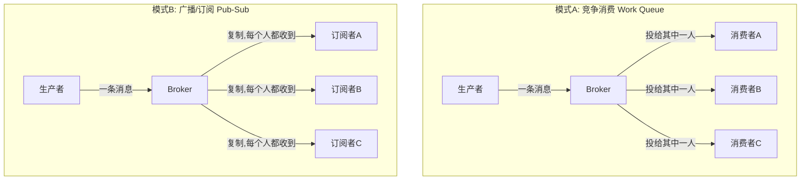
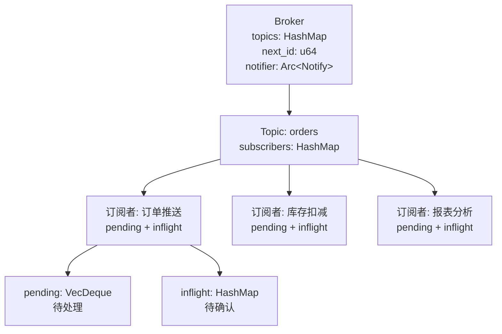
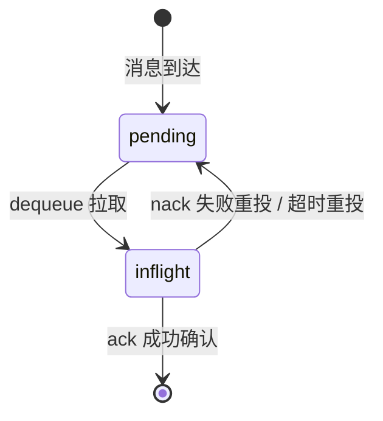

# Mymq-rs 学习文档：从内存 demo 到真正的消息中间件

> 这是一份**引导式教学文档**，目标不是让你复制粘贴一份代码，而是带你**亲手一步步构建**一个支持「广播/订阅 + 消息确认（ack）+ 超时重投」的内存消息队列（MQ）。
>
> 文档采用「**分步实现 + 手动补齐 + 运行验证**」的形式。每一步都会告诉你：
> 1. **本步目标** —— 做完这一步你能得到什么
> 2. **概念讲解** —— 为什么需要它（原理）
> 3. **实现提示** —— 该写哪些结构、哪些方法（骨架 + 引导）
> 4. **验证方式** —— 怎么确认自己写对了

---

## 目录

- [第 0 章 项目现状与三个核心缺陷](#第-0-章-项目现状与三个核心缺陷)
- [第 1 章 概念铺垫：消息队列与两种消费模式](#第-1-章-概念铺垫消息队列与两种消费模式)
- [第 2 章 分步实现（核心章节）](#第-2-章-分步实现核心章节)
  - [步骤一 消息模型：给消息一个身份](#步骤一-消息模型给消息一个身份)
  - [步骤二 订阅者状态：pending 与 inflight](#步骤二-订阅者状态pending-与-inflight)
  - [步骤三 Topic 与订阅注册](#步骤三-topic-与订阅注册)
  - [步骤四 发布广播：复制并分发](#步骤四-发布广播复制并分发)
  - [步骤五 拉取与确认：dequeue / ack / nack](#步骤五-拉取与确认dequeue--ack--nack)
  - [步骤六 超时重投巡检](#步骤六-超时重投巡检)
  - [步骤七 并发共享与主流程](#步骤七-并发共享与主流程)
- [第 3 章 完整扩展路径（学习路线地图）](#第-3-章-完整扩展路径学习路线地图)
- [附录 常用命令与调试技巧](#附录-常用命令与调试技巧)

---

## 第 0 章 项目现状与三个核心缺陷

在动手之前，先看清我们**站在哪里**。这是你当前 `src/main.rs` 的全部代码：

```rust
use std::collections::HashMap;
use tokio::sync::mpsc;

struct Broker {
    queues: HashMap<String, mpsc::Sender<String>>,
}

impl Broker {
    fn new() -> Self {
        Broker {
            queues: HashMap::new(),
        }
    }

    fn create_queue(&mut self, name: &str) -> mpsc::Receiver<String> {
        let (tx, rx) = mpsc::channel(1024);
        self.queues.insert(name.to_string(), tx);
        rx
    }

    async fn publish(&self, queue: &str, msg: String) {
        if let Some(tx) = self.queues.get(queue) {
            let _ = tx.send(msg).await;
        }
    }
}

#[tokio::main]
async fn main() {
    let mut broker = Broker::new();
    let mut rx = broker.create_queue("orders");

    broker.publish("orders", "订单：001；宫保鸡丁".into()).await;
    broker.publish("orders", "订单：002；红烧肉".into()).await;

    while let Some(msg) = rx.recv().await {
        println!("处理订单：{}", msg);
    }
}
```

`Cargo.toml` 依赖也很简单：

```toml
[dependencies]
tokio = { version = "1.53.1", features = ["rt-multi-thread", "macros", "sync", "time"] }
# 注：步骤七用到了 tokio::time::sleep，因此需要 "time" 特性
```

### 它现在能做什么？

- `Broker` 用 `HashMap<String, mpsc::Sender<String>>` 维护「队列名 → 发送端」的映射
- `create_queue` 新建一个容量 1024 的 channel，把发送端存起来，返回接收端
- `publish` 往对应队列的发送端塞一条字符串消息
- `main` 里创建一个 `orders` 队列，发布两条订单消息，然后在一个 `while` 循环里消费打印

### 三个核心缺陷

这个 demo 距离真正的 MQ 还差得很远，**关键缺陷有三个**，也正是我们本次要攻克的：

| 缺陷 | 表现 | 后果 |
|------|------|------|
| **1. 一个队列只有一个接收者** | `create_queue` 只返回**一个** `Receiver` | 无法支持多个消费者；`mpsc` 天生是「一进一出」 |
| **2. 无消息确认（ack）** | `rx.recv()` 拿到消息就算消费完 | 消费者处理**失败**时消息直接丢失，没有重投机制 |
| **3. 状态难以共享** | `main` 里只有一个局部 `Broker` | 无法同时让多个消费者/生产者 task 并发访问，为以后网络化埋下隐患 |

> 💡 **动手前先想清楚**：真正的消息中间件（RabbitMQ / Kafka / Redis）都具备「多消费者、消息确认、重投、持久化」能力。我们这次要做的就是把这些能力**逐个补上**，而且每一步都能独立运行、能看效果。

---

## 第 1 章 概念铺垫：消息队列与两种消费模式

### 1.1 什么是消息队列

消息队列（MQ）是一个**中转站**：生产者（Producer）把消息放进队列，消费者（Consumer）从队列取出来处理。两者**解耦**——生产者不关心谁在处理，消费者也不关心谁在发。

```
Producer ──publish──▶ [ Broker 中转站 ] ──deliver──▶ Consumer
```

### 1.2 两种消费模式（重点！）

「多个消费者」在真 MQ 里有**两种完全不同的语义**，实现天差地别：



| 维度 | 竞争消费（Work Queue） | 广播/订阅（Pub-Sub） |
|------|------------------------|----------------------|
| 一条消息处理次数 | **1 次**（被其中一人抢到） | **N 次**（每个订阅者都处理） |
| 典型场景 | 订单处理、任务分发 | 事件通知、实时推送 |
| 类比 | 排队叫号，号被一个人取走 | 公众号推送，所有粉丝都收到 |
| 你要做的 | 不做 | **✅ 本次目标** |

> 你选的是**广播/订阅**。它的心智模型是：**「发一条事件，所有关心这件事的人各自处理一遍」**。

### 1.3 广播场景下的 ack 作用域（关键难点）

在**竞争消费**里，一条消息只有一个消费者，ack 掉就删，语义简单。

但在**广播订阅**里，一条消息要发给**多个订阅者**，每个订阅者**独立处理、独立确认**。这就带来一个必须想清楚的问题：

> **ack 到底确认谁的？**

答案：**ack 是「订阅者自己」的，不是消息全局的。**

- 订阅者 A 处理**成功** → ack 掉 A 自己这份
- 订阅者 B 处理**失败** → nack，**只重投给 B**，不影响 A、C 的进度
- 每个订阅者都有自己的 `pending`（待处理）和 `inflight`（待确认），**完全隔离**

这正是 Kafka 里 **consumer group + offset** 的思想，只是你的场景里每个订阅者相当于一个独立 group。

> 💡 **本项目的灵魂设计**：`Broker` 里不再只有「队列 → 消息」，而是「**topic → 多个订阅者 → 每个订阅者各自的状态**」。

---

## 第 2 章 分步实现（核心章节）

> ⚠️ **重要约定**：本章每一步都要**修改 `src/main.rs`**。为了让你真正学会，代码只给**必要的骨架**，核心逻辑留给你自己补。每步之间可以独立编译，但最好按顺序做，因为结构是层层叠加的。
>
> 🕐 **时间与脱困提示**：核心 7 步预计 **3–4 小时**。每步都标了「建议耗时」；如果某步超过 **1 小时**还没通过验证，说明卡在某个概念上——先停下来，翻到附录的调试技巧，或直接跳到下一步（后面的参考代码会带出前面缺的部分），回头再来补。**卡住本身是学习的一部分，别硬扛。**
>
> 开始前，先明确最终的数据结构蓝图，你每写一步都往这个方向靠：



---

### 步骤一 消息模型：给消息一个身份

> ⏱ **建议耗时**：20–30 分钟

**本步目标**：把「裸字符串」升级为「带 ID 的消息」。

**概念讲解**：

你现在的消息就是 `String`。为什么需要 ID？

1. **ack/nack 定位**：消费者处理完要说「我处理了第几条消息」，没有 ID 无法精确指认
2. **日志跟踪**：消息从发布→投递→确认，全程用 ID 追踪
3. **全局唯一**：用 `Broker` 里的一个自增计数器生成

**实现提示**：在 `main.rs` 顶部加两个结构：

```rust
/// 一条消息：body 是内容，id 是它在 broker 里的全局唯一编号
#[derive(Clone)]
struct Message {
    id: u64,
    body: String,
}
```

在 `Broker` 里加一个计数器字段：

```rust
struct Broker {
    // ... 稍后替换掉原来的 queues 字段
    next_id: u64,   // 下一个可用的消息 ID
}
```

`new()` 里把它初始化为 `1`。

**请你动手**：写一个方法 `Broker::next_message_id(&mut self) -> u64`，每次返回当前值并自增。

**验证方式**：暂无独立运行效果，但保证 `cargo build` 通过即可（此时还没改 `main`，可能报未使用警告，忽略即可）。

---

### 步骤二 订阅者状态：pending 与 inflight

> ⏱ **建议耗时**：20–30 分钟

**本步目标**：定义「一个订阅者自己的消息状态」。

**概念讲解**：每个订阅者维护两张表：



- **pending（待处理）**：`VecDeque` 先进先出，等待被拉取
- **inflight（待确认）**：`HashMap`，消息已被某订阅者取走、正在处理、还没确认

为什么 inflight 用 `HashMap`？因为要**按 id 快速定位**哪条消息待确认；而 pending 用 `VecDeque` 保证 FIFO 顺序。

**实现提示**：

```rust
use std::time::Instant;

/// 某个订阅者自己的消费状态（pending + inflight 完全隔离）
struct SubscriberState {
    /// 待投递给该订阅者的消息（FIFO 队列）
    pending: std::collections::VecDeque<Message>,
    /// 已投递、等待 ack 的消息：msg_id -> (消息, 投递时间)
    inflight: std::collections::HashMap<u64, (Message, Instant)>,
}

impl SubscriberState {
    fn new() -> Self {
        SubscriberState {
            pending: std::collections::VecDeque::new(),
            inflight: std::collections::HashMap::new(),
        }
    }
}
```

> 注意 `inflight` 里存了 `Instant`（投递时刻），这是为了步骤六的超时判断——记录「这条消息是什么时候被投出去的」。

**请你动手**：补全上面代码，并确认 `use std::time::Instant` 已引入。

**验证方式**：`cargo build` 通过。

---

### 步骤三 Topic 与订阅注册

> ⏱ **建议耗时**：25–35 分钟

**本步目标**：用 `Topic` 把「多个订阅者」组织起来，并实现 `subscribe`。

**概念讲解**：

- **Topic（主题）**：一类消息的集合，比如 `orders`（订单）。它名下挂着**多个订阅者**
- 每个订阅者一个 `SubscriberState`，各自进度独立
- `subscribe(topic, subscriber)`：如果 topic 不存在就创建，然后把订阅者注册进去

这一步正是「广播」的数据基础：一个 topic 下有 N 个订阅者，发布一条消息就要复制 N 份。

**实现提示**：

```rust
/// 一个 topic：维护所有订阅者的独立状态
struct Topic {
    subscribers: std::collections::HashMap<String, SubscriberState>,
}

impl Topic {
    fn new() -> Self {
        Topic {
            subscribers: std::collections::HashMap::new(),
        }
    }
}
```

然后**替换** `Broker` 里的 `queues` 字段为：

```rust
struct Broker {
    topics: std::collections::HashMap<String, Topic>,
    next_id: u64,
    // 用 Arc<Notify> 而不是 Notify：步骤七要让订阅者在「不占锁」的情况下等待通知
    notifier: std::sync::Arc<tokio::sync::Notify>, // 稍后在步骤七用到，先留占位
}
```

在 `Broker` 上实现订阅方法：

```rust
/// 订阅一个 topic（不存在则自动创建）
fn subscribe(&mut self, topic: &str, subscriber: &str) {
    self.topics
        .entry(topic.to_string())
        .or_insert_with(Topic::new)
        .subscribers
        .entry(subscriber.to_string())
        .or_insert_with(SubscriberState::new);
}
```

> 📖 **知识点**：`HashMap::entry(...).or_insert_with(...)` 是「有则复用、无则创建」的惯用法。如果你不熟悉，花 5 分钟查一下 `entry` API，这是 Rust 常用模式。

**请你动手**：补全 `Topic` 结构、改造 `Broker` 字段、实现 `subscribe`。别忘了在 `new()` 里把 `notifier` 初始化为 `Arc::new(tokio::sync::Notify::new())`，并在文件顶部 `use std::sync::Arc;`。

**验证方式**：`cargo build` 通过（此时原来的 `publish`/`create_queue` 方法已因字段改名而报错，**不要修**，下一步会重写它们）。

---

### 步骤四 发布广播：复制并分发

> ⏱ **建议耗时**：20–30 分钟

**本步目标**：实现 `publish`，把一条消息**复制**推给该 topic 的**每个订阅者**。

**概念讲解**：

广播的核心是「**复制**」：一条消息进来，要给它分配一个全局 ID，然后克隆给 topic 下的每一个订阅者，各自塞进自己的 `pending` 队尾。

```
publish("orders", "新订单 001")
        │
        ├──▶ 订阅者A.pending.push(复制1)
        ├──▶ 订阅者B.pending.push(复制2)
        └──▶ 订阅者C.pending.push(复制3)
```

> 注意消息的 `id` 是**全局唯一的**（同一份），`body` 内容相同，但被**复制**到多个订阅者的 pending 里。这也是为什么 `Message` 要 `#[derive(Clone)]`。

**实现提示**：在 `Broker` 上实现（**替换**原来的 `publish`）：

```rust
/// 发布消息：广播给该 topic 的所有订阅者
fn publish(&mut self, topic: &str, body: String) -> u64 {
    let id = self.next_message_id();   // 你在步骤一写的方法
    let msg = Message { id, body };
    if let Some(t) = self.topics.get_mut(topic) {
        for sub in t.subscribers.values_mut() {
            sub.pending.push_back(msg.clone()); // 复制给每个订阅者
        }
        // 唤醒所有正在等待的订阅者。
        // 注意是 notify_waiters 而不是 notify_one：广播场景有多个订阅者同时在等，
        // 只唤醒一个，其余订阅者就永远等下去了。
        self.notifier.notify_waiters();
    }
    id
}
```

**请你动手**：完成 `publish`。思考：如果 topic 不存在会怎样？（提示：`get_mut` 返回 `None` 则什么都不做——所以发布前应先 `subscribe`。）再思考：为什么这里用 `notify_waiters()` 而不是 `notify_one()`？（提示：3 个订阅者同时在等，只唤醒 1 个，另外 2 个就永远等下去了。）

**验证方式**：`cargo build` 通过。现在可以临时写几行测试，手动建一个 topic、注册 2 个订阅者、发布 1 条消息，打印各自的 `pending.len()`，应都是 1。

---

### 步骤五 拉取与确认：dequeue / ack / nack

> ⏱ **建议耗时**：35–45 分钟

**本步目标**：实现消费的三大操作，并体会「**ack 只影响订阅者自己**」。

**概念讲解**：

这是 MQ 的**灵魂**。三个操作各自独立、只作用于**指定订阅者**：

| 操作 | 作用 | 状态流转 |
|------|------|---------|
| `dequeue(topic, sub)` | 某订阅者拉取一条自己的消息 | `pending` → `inflight` |
| `ack(topic, sub, id)` | 该订阅者确认处理成功 | `inflight` → 删除 |
| `nack(topic, sub, id)` | 该订阅者处理失败，要求重投 | `inflight` → `pending` 队尾 |

**实现提示**：

```rust
/// 某订阅者拉取一条自己的消息（从 pending 队首取，移入 inflight）
fn dequeue(&mut self, topic: &str, sub: &str) -> Option<Message> {
    let state = self.topics.get_mut(topic)?.subscribers.get_mut(sub)?;
    let msg = state.pending.pop_front()?;
    // 记录投递时间
    state.inflight.insert(msg.id, (msg.clone(), std::time::Instant::now()));
    Some(msg)
}

/// 某订阅者确认处理成功：从自己的 inflight 删除
fn ack(&mut self, topic: &str, sub: &str, msg_id: u64) -> bool {
    match self
        .topics
        .get_mut(topic)
        .and_then(|t| t.subscribers.get_mut(sub))
    {
        Some(s) => s.inflight.remove(&msg_id).is_some(),
        None => false,
    }
}

/// 某订阅者处理失败：把消息放回自己的 pending 队尾（重投给自己）
fn nack(&mut self, topic: &str, sub: &str, msg_id: u64) -> bool {
    if let Some(s) = self
        .topics
        .get_mut(topic)
        .and_then(|t| t.subscribers.get_mut(sub))
    {
        if let Some((msg, _)) = s.inflight.remove(&msg_id) {
            s.pending.push_back(msg);
            return true;
        }
    }
    false
}
```

> 📖 **知识点**：`?` 操作符在 `Option` 上的用法——`get_mut(topic)?` 若返回 `None` 则整个函数返回 `None`，这是 Rust 优雅的错误传播。`pop_front()?` 同理，队列空则返回 `None`。

**请你动手**：补全三个方法，并特别理解 `ack`/`nack` 都只通过 `subscribers.get_mut(sub)` 定位到**单个订阅者**，不会碰其他订阅者的状态。

**验证方式**：这次不用临时打印，直接把它写成**单元测试**（从本步起，我们开始穿插练习测试）：

```rust
#[cfg(test)]
mod tests {
    use super::*;

    /// 广播隔离：A 的 nack 只会影响 A 自己，B 不受牵连
    #[tokio::test]
    async fn ack_nack_isolation() {
        let mut b = Broker::new();
        b.subscribe("orders", "A");
        b.subscribe("orders", "B");
        b.publish("orders", "测试消息".into());

        let msg_a = b.dequeue("orders", "A").unwrap();
        assert!(b.nack("orders", "A", msg_a.id));

        // A 的消息被重投回 A 的 pending
        let state_a = b.topics.get("orders").unwrap().subscribers.get("A").unwrap();
        assert_eq!(state_a.pending.len(), 1);
        assert!(state_a.inflight.is_empty());

        // B 的 pending 仍是 1——那是广播复制给 B 自己的那份，A 的操作碰不到它
        let state_b = b.topics.get("orders").unwrap().subscribers.get("B").unwrap();
        assert_eq!(state_b.pending.len(), 1);
        assert!(state_b.inflight.is_empty());
    }
}
```

> 运行 `cargo test`。能通过，就证明「**广播隔离效果**」成立——这也是你写的第一个 MQ 单元测试。之后的步骤会继续沿用这个习惯。

---

### 步骤六 超时重投巡检

> ⏱ **建议耗时**：35–45 分钟

**本步目标**：加一个后台任务，把「拉取了但超时没确认」的消息自动重投。

**概念讲解**：

如果消费者 `dequeue` 后**崩了**或**卡死**，那条消息会一直躺在 `inflight` 里没人管。真实 MQ 需要一个**巡检机制**：定期扫描每个订阅者的 `inflight`，凡是**投递时间超过阈值**还没 ack/nack 的，就自动放回 `pending` 重新投递。

关键点：
- 用 `inflight` 里存的 `Instant` 判定「是否超时」
- `Instant::now().elapsed() > timeout` 即视为超时
- 巡检是**周期性**运行的（每 timeout 间隔跑一次）

**实现提示**：在 `Broker` 上实现：

```rust
use std::time::Duration;

/// 重投超时未确认的消息（对每个订阅者自己的 inflight 巡检）
fn redeliver_timeout(&mut self, timeout: Duration) {
    for topic in self.topics.values_mut() {
        for sub in topic.subscribers.values_mut() {
            // 收集超时的消息 id（注意：不能边遍历边删除，先收集再删）
            let expired: Vec<u64> = sub
                .inflight
                .iter()
                .filter(|(_, (_, at))| at.elapsed() > timeout)
                .map(|(id, _)| *id)
                .collect();
            for id in expired {
                if let Some((msg, _)) = sub.inflight.remove(&id) {
                    sub.pending.push_back(msg);
                }
            }
        }
    }
}
```

> 📖 **知识点（重要）**：为什么先 `.collect()` 成 `Vec` 再删？因为 Rust 不允许在**借用** `sub.inflight` 的同时**修改**它（借用冲突）。必须先收集要删的 id，结束借用后再删。这是 Rust 所有权/借用系统的经典场景，务必亲手体会。

**请你动手**：补全 `redeliver_timeout`，并思考：为什么巡检是「每个订阅者各自」做的？

**验证方式**：这次给你一个**不依赖步骤七**的独立验证——把「模拟超时」写进测试：手动把 `inflight` 里某条消息的投递时间改成 1 分钟前，再调用巡检，它就应该回到 `pending`：

```rust
#[tokio::test]
async fn redeliver_expired_message() {
    let mut b = Broker::new();
    b.subscribe("orders", "A");
    b.publish("orders", "超时消息".into());

    // dequeue 后不 ack，模拟消费者卡死
    let msg = b.dequeue("orders", "A").unwrap();
    let s0 = b.topics.get("orders").unwrap().subscribers.get("A").unwrap();
    assert_eq!(s0.pending.len(), 0);

    // 关键技巧：把投递时间手动改成 60 秒前，模拟「超时未确认」
    let state = b.topics.get_mut("orders").unwrap().subscribers.get_mut("A").unwrap();
    if let Some((_, at)) = state.inflight.get_mut(&msg.id) {
        *at = std::time::Instant::now() - std::time::Duration::from_secs(60);
    }

    // 用 1 秒的阈值巡检，应把这条消息重投回 pending
    b.redeliver_timeout(std::time::Duration::from_secs(1));
    let state = b.topics.get("orders").unwrap().subscribers.get("A").unwrap();
    assert_eq!(state.pending.len(), 1);
    assert!(state.inflight.is_empty());
}
```

> 运行 `cargo test` 通过，超时重投逻辑就**独立验证完成**了，不必等步骤七。如果编译报错，多半是字段访问或借用问题，复习一下本步「先 collect 再删」的知识点。

---

### 步骤七 并发共享与主流程（成果展示）

> ⏱ **建议耗时**：50–70 分钟

**本步目标**：把所有零件组装起来——用 `Arc<Mutex<Broker>>` 共享状态，用 `Notify` 唤醒等待的订阅者，跑通完整的多订阅者并发 demo。

**概念讲解**：

1. **为什么用 `Arc<Mutex<Broker>>`**：现在有多个订阅者 task（还有未来的生产者、巡检 task）要**同时**访问同一个 `Broker`。单个 `&mut Broker` 没法同时给多个人用，所以：
   - `Arc`（原子引用计数）让多个 task 共享同一个 broker 的所有权
   - `Mutex` 保证同一时刻只有一个 task 能访问 broker（互斥）
   - `tokio::sync::Mutex` 是异步版本的 Mutex，适合在 `.await` 里持有

2. **为什么用 `Notify`**：订阅者要在「队列没消息时」停下来等，而不是空转轮询浪费 CPU。`Notify` 让生产者发布消息时 `notify_waiters()` 唤醒所有等待中的订阅者（广播场景必须唤醒所有人，不能用 `notify_one`）。这叫做**条件变量**思想。

> ⚠️ **一个微妙的坑**：`Notify` 的唤醒是「一次性」的，而且**不能锁着 `Mutex` 去 `await` 通知**——否则其他任务（发布者 / 巡检 / 统计）都拿不到锁，整个程序卡死。正确做法：把 `notifier` 存成 `Arc<Notify>`（步骤三已改好），先 `clone()` 出一个**不占锁的通知句柄**，然后按「先注册等待 → 再检查有没有消息 → 没有才 `await`」的顺序循环。下方 `wait_for_message` 参考实现就是标准写法。

**实现提示**（这是最后一个、也是最综合的一步，给出较完整参考）：

```rust
/// 消费者等待：直到指定订阅者有可拉取的消息
async fn wait_for_message(broker: &Arc<tokio::sync::Mutex<Broker>>, topic: &str, sub: &str) {
    // 先拿一个「通知句柄」：Arc<Notify> 不占锁，可以安全地带出锁作用域等待
    let notify = broker.lock().await.notifier.clone();
    loop {
        // 顺序很关键：先注册「我要等通知」，再检查有没有消息
        let notified = notify.notified();
        {
            let b = broker.lock().await;
            let ready = b
                .topics
                .get(topic)
                .and_then(|t| t.subscribers.get(sub))
                .map(|s| !s.pending.is_empty())
                .unwrap_or(false);
            if ready {
                return;
            }
        } // 锁在这里释放，等待期间不占锁
        notified.await; // 没有消息就睡，等生产者 notify_waiters 唤醒
    }
}

/// 一个订阅者任务：循环拉取自己的消息，按 fail_rate 概率模拟成功/失败
async fn subscriber(
    broker: Arc<tokio::sync::Mutex<Broker>>,
    topic: &str,
    name: &str,
    fail_rate: u32,
) {
    loop {
        wait_for_message(&broker, topic, name).await;
        let msg = {
            let mut b = broker.lock().await;
            b.dequeue(topic, name)
        };
        if let Some(msg) = msg {
            tokio::time::sleep(std::time::Duration::from_millis(80)).await; // 模拟处理耗时
            let success = (msg.id as u32) % 100 >= fail_rate;
            let mut b = broker.lock().await;
            if success {
                b.ack(topic, name, msg.id);
                println!("[{}] ✅ 处理成功: [{}] {}", name, msg.id, msg.body);
            } else {
                b.nack(topic, name, msg.id);
                println!("[{}] 🔁 处理失败重投: [{}] {}", name, msg.id, msg.body);
            }
        }
    }
}

/// 后台巡检：定期重投超时未确认的消息
async fn redelivery_worker(broker: Arc<tokio::sync::Mutex<Broker>>, timeout: std::time::Duration) {
    loop {
        tokio::time::sleep(timeout).await;
        broker.lock().await.redeliver_timeout(timeout);
    }
}
```

然后重写 `main`（组装全部）：

```rust
#[tokio::main]
async fn main() {
    let broker = Arc::new(tokio::sync::Mutex::new(Broker::new()));

    // 1. 创建 topic 并注册 3 个订阅者（不同业务，独立消费）
    {
        let mut b = broker.lock().await;
        b.subscribe("orders", "订单推送");
        b.subscribe("orders", "库存扣减");
        b.subscribe("orders", "报表分析");
    }

    // 2. 发布消息（广播给 3 个订阅者）
    {
        let mut b = broker.lock().await;
        b.publish("orders", "事件：新订单 001".into());
        b.publish("orders", "事件：新订单 002".into());
        b.publish("orders", "事件：新订单 003".into());
        b.publish("orders", "事件：新订单 004".into());
    }
    println!("=== 已发布 4 条事件，广播给 3 个订阅者 ===");

    // 3. 启动 3 个订阅者 task（fail_rate=30，约 30% 概率 nack 重投）
    let mut tasks = Vec::new();
    for name in ["订单推送", "库存扣减", "报表分析"] {
        let b = Arc::clone(&broker);
        tasks.push(tokio::spawn(subscriber(b, "orders", name, 30)));
    }

    // 4. 启动超时重投巡检（2 秒）
    let b = Arc::clone(&broker);
    tasks.push(tokio::spawn(redelivery_worker(b, std::time::Duration::from_secs(2))));

    // 5. 每 1 秒打印一次统计，观察各订阅者进度隔离
    for _ in 0..5 {
        tokio::time::sleep(std::time::Duration::from_secs(1)).await;
        let b = broker.lock().await;
        println!("\n=== 当前订阅者状态 ===");
        for (t, s, pending, inflight) in b.stats() {
            println!("topic[{}] 订阅者[{}]: 待投递={} 待确认={}", t, s, pending, inflight);
        }
    }

    // 6. 演示运行一段时间后退出
    tokio::time::sleep(std::time::Duration::from_secs(5)).await;
    for t in tasks {
        t.abort();
    }
    println!("\n=== 演示结束 ===");
}
```

> 你会发现 `main` 用到了 `b.stats()` 方法——它还没实现。这是**留给你的最后一块拼图**。

**请你动手**：实现 `Broker::stats()`，返回每个「topic + 订阅者」的 `pending` 和 `inflight` 数量，结构可参考 `Vec<(String, String, usize, usize)>`（topic名, 订阅者名, pending数, inflight数）。

**验证方式（最终验收）**：

1. `cargo run`
2. 观察输出：3 个订阅者**各自**处理了所有 4 条事件（每个都应出现 4 次成功打印，这就是广播）
3. 观察 🔁 重投日志：某些消息因 `fail_rate` 被重投
4. 观察统计表：各订阅者的 `pending`/`inflight` **互不影响**

> 如果一切正常，恭喜——你已经手动实现了「**广播订阅 + 每订阅者独立 ack + 超时重投**」的内存消息队列！

**最终核对清单**：你的 `main.rs` 里应该已经具备这些零件，缺哪个就回去补：

- 结构：`Message` / `SubscriberState`（`pending` + `inflight`）/ `Topic` / `Broker`（含 `notifier: Arc<Notify>`）
- `Broker` 方法：`new` / `next_message_id` / `subscribe` / `publish` / `dequeue` / `ack` / `nack` / `redeliver_timeout` / `stats`
- 函数：`wait_for_message` / `subscriber` / `redelivery_worker` + 组装好的 `main`
- 测试：步骤五、六加的两个 `#[tokio::test]`（`cargo test` 应全绿）

---

## 第 3 章 完整扩展路径（学习路线地图）

你已经完成了核心的**第 1 阶段**。下面是完整的后续路线，标注了每个阶段的技术要点和前置依赖，你可以按自己的兴趣和节奏逐级推进。


| 阶段 | 做什么 | 关键知识点 | 前置依赖 |
|------|--------|-----------|---------|
| **第 1 阶段 ✅**（已完成） | 广播订阅 + 每订阅者独立 ack + 超时重投 | `Arc`/`Mutex`/`Notify`、生命周期状态机 | 无 |
| **第 2 阶段：TCP 服务化** | 把 `publish`/`dequeue`/`ack`/`nack` 变成 TCP 命令，`TcpListener` + 每连接一个 task，自定义文本/二进制协议 | `tokio::net::TcpListener/TcpStream`、`tokio::io::AsyncRead/Write`、协议编解码、帧边界处理 | 第 1 阶段 |
| **第 3 阶段：持久化** | 消息 append-log 追加写磁盘，启动时恢复；思考刷盘频率、性能权衡 | `std::fs`、`File` 追加写、启动恢复、崩溃一致性 | 第 2 阶段 |
| **第 4 阶段：topic 路由** | 类似 RabbitMQ 的 exchange + routing key 绑定，让消息按规则路由到不同队列 | 路由表、binding key 匹配、多 exchange 类型 | 第 2 阶段 |
| **第 5 阶段：HTTP 管理接口** | 用 `axum` 提供 REST API，查询队列/订阅者/消息数，做管理界面 | `axum`、JSON 序列化（`serde`）、HTTP 路由 | 第 2 阶段 |

### 各阶段详解与建议

**第 2 阶段：TCP 服务化（强烈推荐下一步）**
- 这是把内存 demo 变成**真正 client-server 架构**的质变，直接命中你想深入的「网络协议设计」
- 你现在的 `Broker` 用 `Arc<Mutex<>>` 包好，**正是为这一步准备的**——每个 TCP 连接就是一个 task，共享同一个 broker
- 协议建议从简单的文本命令开始：`PUBLISH <topic> <msg>`、`CONSUME <topic> <sub>`、`ACK <id>`、`NACK <id>`
- 重点难点：TCP 是字节流，没有消息边界，需要自己处理「粘包/拆包」问题

**第 3 阶段：持久化**
- 命中你想深入的「文件与 I/O」
- 最简单的方案：消息到达时追加写一个 log 文件，启动时读回 `pending`
- 进阶思考：写日志 vs 定期快照、崩溃后如何保证不丢、是否需要 fsync

**第 4 阶段：topic 路由**
- 引入 RabbitMQ 的 exchange 概念：direct / fanout / topic 三种路由模式
- 让生产者在 exchange 上发消息，按 routing key 路由到绑定的队列
- 这是「广播」的泛化——广播其实是 fanout（所有人都收到）

**第 5 阶段：HTTP 管理接口（可选）**
- 命中「网络协议设计」的 HTTP 分支
- 加 `axum` 依赖，提供 `GET /stats`、`POST /topic/{name}` 等接口
- 可以把查询逻辑复用你已写好的 `stats()` 方法

> 💡 **学习节奏建议**：不必一口气全做完。第 2 阶段（TCP）是承上启下的关键，建议先攻它。做完后你会对「网络 + 并发 + 协议」有完整认知，再往后的阶段都属于锦上添花。

---

## 附录 常用命令与调试技巧

```bash
# 编译检查（不改文件，快速反馈）
cargo check

# 编译并运行
cargo run

# 编译（生成可执行文件，不改动）
cargo build

# 查看依赖树（确认只有 tokio）
cargo tree
```

**调试技巧**：

1. **借用冲突报错**：Rust 最常遇到的错误。记住「不能边借用边修改」。参考步骤六的「先 collect 再删」模式。
2. **检查并发输出**：广播正确性的铁证是——每个订阅者都打印了**相同的消息 ID** 集合（虽然顺序可能不同）。
3. **测试超时重投**：把订阅者的处理耗时调大（比如 `sleep(3000ms)`），并把巡检间隔调小（如 `1s`），就能看到消息被自动重投。
4. **想观察隔离效果**：只给「库存扣减」订阅者设 `fail_rate=100`（全失败），其他订阅者设 `0`，看它反复重投而其他订阅者正常完成。

---

> 🎉 **到这里，你已经走完了核心学习路径**。这份文档没有给你一份「抄完就跑」的完整代码，而是带你理解了消息队列最本质的几个问题：**消息如何被识别、如何被复制分发、如何被确认与重投、如何在并发下共享状态**。带着这些理解，你就可以放心去挑战第 2 阶段的网络化改造了。
